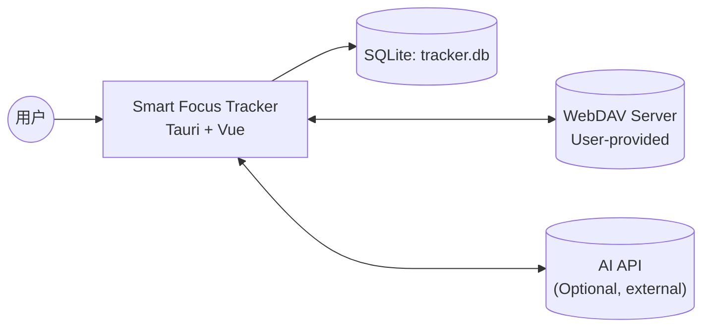
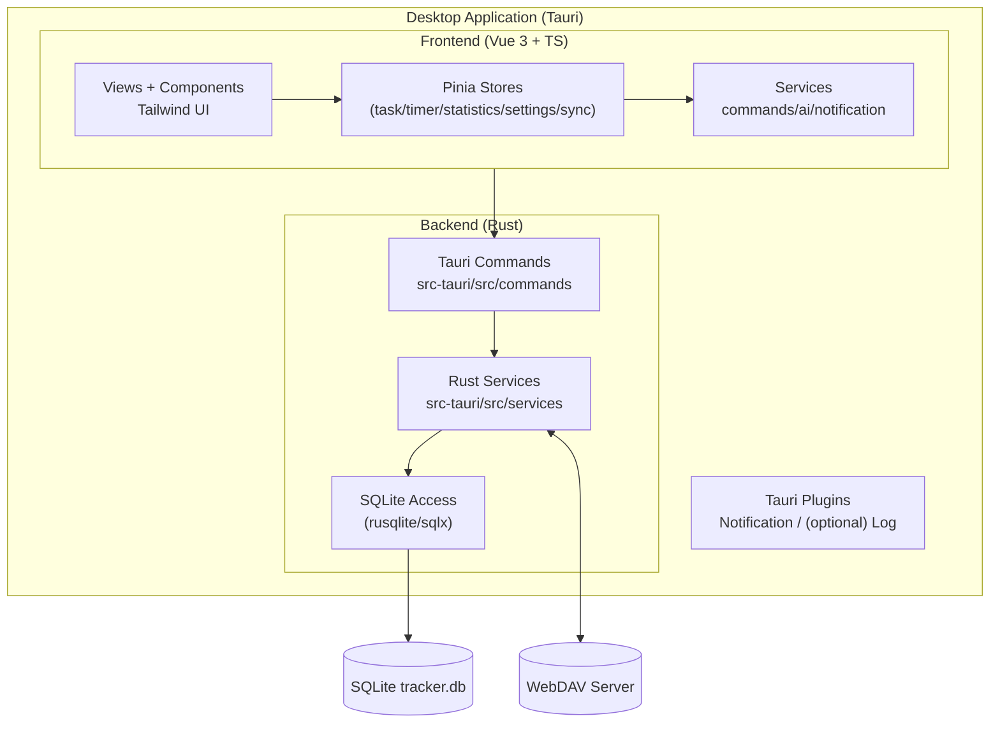
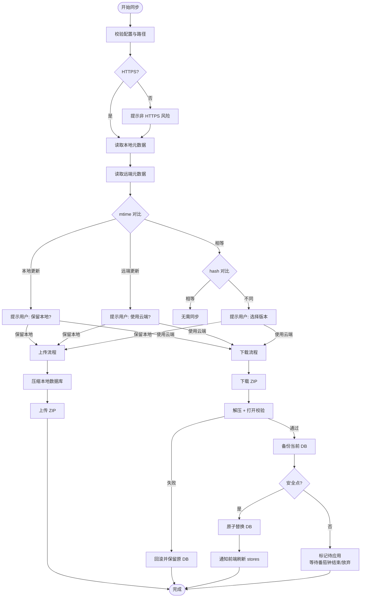
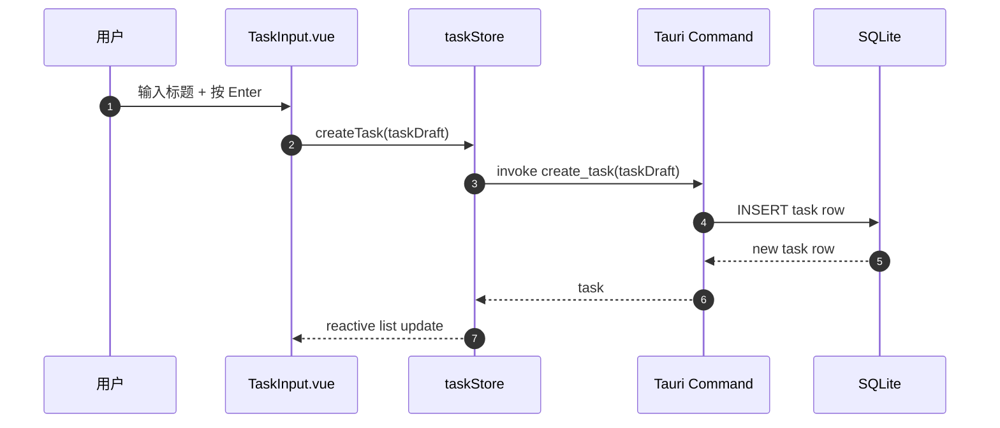
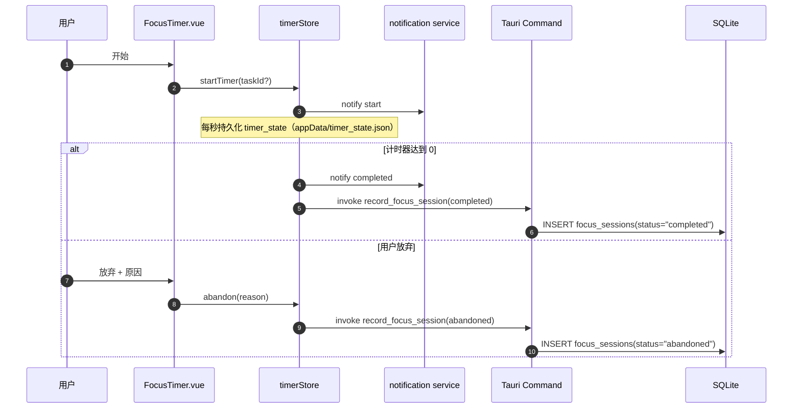
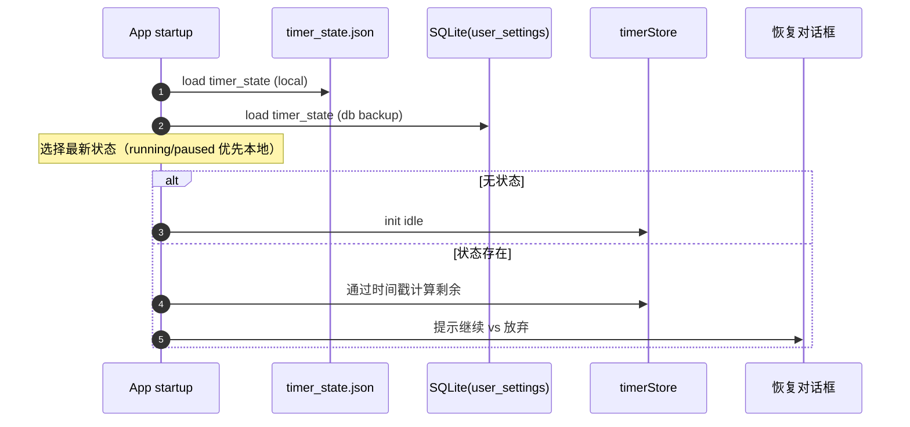
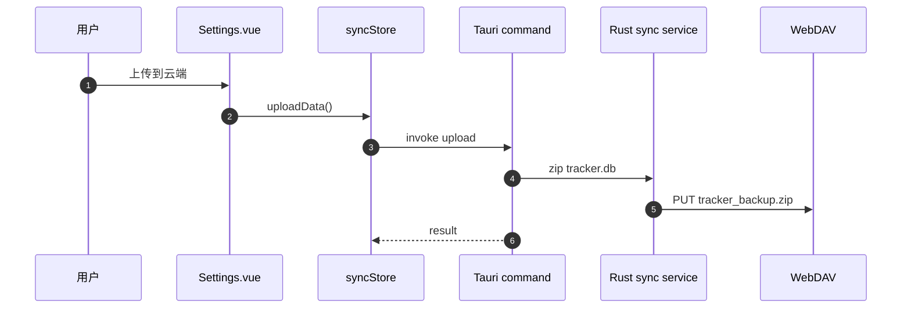

# Smart Focus Tracker — 架构文档 (v1)

本文档描述 **Smart Focus Tracker** 的目标系统架构（规划稿），用于指导后续实现。当前仓库为文档快照，不包含可执行源码。

本文档与以下文档对齐：
- `REQUIREMENTS.md` **v2.5** (2026-01-18)
- `DESIGN.md` **v1.2** (2026-01-17)

本文档作为工程参考：说明什么在哪里运行、数据如何流动，以及扩展点在哪里。

---

## 1. 架构目标

### 1.1 核心目标
- **本地优先**：核心功能可离线工作；所有用户数据默认本地存储。
- **清晰的 UI 与原生边界**：Vue WebView 处理 UX 和大部分领域逻辑；Rust/Tauri 提供操作系统 + 文件/网络能力。
- **可靠持久化**：SQLite 模式 + 迁移确保数据向前兼容的演进。
- **可选同步**：用户控制的 WebDAV 同步；无强制云账户。
- **隐私设计**：AI 功能可选，优雅降级，并应最小化敏感数据暴露。

### 1.2 非目标（当前范围）
- 团队协作 / 多用户共享工作区。
- 专有云后端。
- 无需用户显式配置的始终开启后台同步。

---

## 2. 系统上下文与边界

### 2.1 上下文
Smart Focus Tracker 是一个 **桌面应用（Tauri 2 + Vue 3）**，它：
- 在 **本地 SQLite 数据库** (`tracker.db`) 中存储任务、设置、专注会话和分析数据。
- 可选地通过 **WebDAV** 同步数据库文件（用户提供的服务器）。
- 可选地提供 AI 辅助建议（当前为模拟）。

### 2.2 信任边界
- **用户设备边界（受信任）**：本地 SQLite 数据库、UI 状态、本地设置。
- **网络边界（不受信任）**：WebDAV 服务器和任何外部 AI API 端点。
- **Tauri 边界**：前端在 WebView 沙箱中运行；特权操作通过 Tauri 插件或 `invoke` 命令进行。

### 2.3 上下文图（C4 风格）


---

## 3. 高层容器

### 3.1 容器图


### 3.2 UI 路由入口
规划路由（建议）：
- `/` 首页（仪表板）
- `/tasks` 任务列表 + 详情
- `/timer` 专注计时器
- `/statistics` 图表 + 聚合
- `/settings` 偏好设置 + WebDAV 操作

---

## 4. 前端架构（Vue 3 + Pinia）

### 4.1 层次与职责

#### 视图（`src/views/*`）
页面级组合与编排：
- 在挂载时触发初始数据获取
- 组合布局与组件
- 将组件连接到 store

示例：
- `src/views/Tasks.vue`：加载任务；打开 `TaskDetail` 覆盖层。
- `src/views/Settings.vue`：加载设置 + 同步配置；触发测试/上传/下载。

#### 组件（`src/components/*`）
可复用的 UI 块：
- 任务：`TaskInput`、`TaskItem`、`TaskDetail`
- 计时器：`FocusTimer`
- 图表：`ActivityChart`
- AI：`DailyPlanModal`
- UI 原语：`Button`、`Input`、`Checkbox` 等。

#### Stores（`src/stores/*`）
Pinia stores 充当"应用状态 + 领域操作"层。

规划 stores：
- `taskStore`：任务状态与列表派生；通过 Rust commands 完成 CRUD。
- `timerStore`：计时器状态机（番茄钟/休息）+ 通知 + 本地持久化。
- `statisticsStore`：图表数据与筛选条件；通过 Rust commands 获取聚合结果。
- `settingsStore`：设置状态；通过 Rust commands 读写（落库到 `user_settings`）。
- `syncStore`：WebDAV 配置与同步状态；通过 Rust commands 执行同步。

#### 服务（`src/services/*`）
- `src/services/commands/*`：封装 `invoke()`（tasks/habits/statistics/settings/sync）。
- `src/services/notification.ts`：封装 `@tauri-apps/plugin-notification`。
- `src/services/ai/*`：上下文构建和 **模拟 AI** 调用。

---

## 5. Tauri 边界与原生架构（Rust）

### 5.1 命令边界（前端 ↔ Rust）
前端使用 `invoke()` 调用特权原生功能。

建议命令接口覆盖：tasks/habits/statistics/settings/sync 等能力，WebDAV 同步为其中之一。

### 5.2 Rust 模块（建议）
- `src-tauri/src/commands/*`
  - 对前端暴露的 Tauri commands（任务/习惯/统计/设置/同步）。
- `src-tauri/src/db/*`
  - SQLite 打开、迁移、查询与事务封装。
- `src-tauri/src/services/sync.rs`
  - 核心 WebDAV 操作（压缩/解压、上传/下载、冲突检测、备份、原子替换）。

### 5.3 Tauri 插件
- `tauri-plugin-notification`：原生通知分发。
- 通知历史建议落库（`notification_logs`），供应用内“通知中心”展示与筛选（通过 commands 访问）。

---

## 6. 数据架构（SQLite + 迁移）

### 6.1 数据库位置与所有权
- 数据库名称：`tracker.db`
- 数据库由 **Rust 侧**统一打开与管理（前端不直连 SQLite，仅通过 commands 读写）。
- 建议存放位置：应用数据目录（Tauri `appDataDir`）下。

### 6.2 迁移策略
- 迁移在应用启动阶段（注册 commands 前）由 Rust 侧执行。
- 使用 `PRAGMA user_version` 维护版本号，按版本升序、在事务中执行，失败回滚。

### 6.3 核心表（规划）
- `user_settings`
- `projects`、`tags`
- `tasks`（`parent_id` 支持一级子任务；`deleted_at` 支持 10 秒撤销窗口）
- `task_tags`
- `focus_sessions`
- `ai_logs`
- `notification_logs`（通知中心历史）
- `task_completion_logs`、`task_deletion_logs`
- `daily_summaries`
- `habits`、`habit_logs`、`habit_stats`

### 6.4 习惯（需求 vs 规划）
- 习惯子系统为 `REQUIREMENTS.md v2.5` 的 P1 必需模块，应纳入数据库基础 schema 与迁移策略。

### 6.5 数据管理（导出/导入/清空/每日备份）
为满足可迁移与可恢复诉求，建议由 Rust 侧提供数据管理 commands：

- 导出：从 SQLite 读取并生成 JSON（必选）/CSV（可选）文件。
- 导入：从 JSON 备份导入；导入前自动备份；建议采用“替换导入”以降低 merge 复杂度。
- 清空：关闭 DB 连接后重建 DB 并重新跑 migrations。
- 每日备份：每日生成 `appData/backups/daily_YYYYMMDD.db`，保留最近 7 份。

---

## 7. WebDAV 同步架构

### 7.1 范围
- 同步是 **可选的** 且用户配置的。
- 服务器是 **用户提供的** WebDAV。
- 同步产物是 **数据库文件**（文件级同步）。

### 7.2 规划实现（手动上传/下载）
前端在设置页触发同步命令：
- 测试连接
- 上传 DB（zip）到 WebDAV
- 从 WebDAV 下载 DB（zip）并替换本地 DB

### 7.3 必需行为（根据 `REQUIREMENTS.md v2.5`）
- 后台同步不应阻塞 UI。
- 冲突检测：先比较时间戳，如果相等再比较哈希。
- 原子同步 + 回滚语义。
- 冲突解决前的备份保留（保留最后 10 个冲突备份）。
- 非 HTTPS 警告。
- 番茄钟运行中允许上传；如需下载/替换数据库，延迟到安全点（番茄钟结束/放弃后）再执行。

### 7.4 目标管道（推荐）
1. 预检查验证配置 + HTTPS 警告。
2. 收集本地元数据（mtime/size/hash）和远程元数据（mtime/size/hash）。
3. 决定方向或提示用户。
4. 暂存到临时文件，验证解压 + DB 打开。
5. 安全点检查：如存在运行中的番茄钟且需要替换 DB，则标记为待应用（deferred apply）。
6. 带备份原子交换文件（在安全点执行）。
7. 替换完成后通知前端刷新 stores（任务/统计/习惯），计时器状态不受影响。

### 7.5 同步决策流程图


---

## 8. 计时器架构（番茄钟）+ 持久化/恢复

### 8.1 需求要点（v2.5）
- 计时器状态每秒持久化一次。
- 应用重启：如果有未完成的，提示"继续 vs 放弃"。
- 睡眠恢复：自动扣除休眠时长继续计时（无需用户确认，认真工作时息屏是正常的）。
- 休眠期间番茄钟完成：自动记录为完成，发送通知。
- 暂停 > 30 分钟：显示警告提示；暂停 > 2 小时：自动放弃。
- 运行中的计时器不允许切换任务。

### 8.2 规划实现（运行态）
- 前端 `timerStore` 维护运行态（UI 状态机 + 倒计时刷新）。
- Rust 负责落库 `focus_sessions` 与关键日志，避免前端直连 DB。

### 8.3 目标持久化设计
计时器状态采用**双写**，兼顾崩溃恢复与“同步替换 DB”安全：

- 本地文件（运行态权威）：`appData/timer_state.json`（每秒写入）
- 数据库备份（用于恢复/诊断）：`user_settings.key = 'timer_state'`（状态变更写入，避免每秒写 DB）

建议的负载：
```json
{
  "taskId": 123,
  "taskTitleSnapshot": "Write chapter 3",
  "mode": "pomodoro",
  "status": "running",
  "startedAt": "2026-01-17T10:00:00.000Z",
  "lastTickAt": "2026-01-17T10:05:12.000Z",
  "remainingSeconds": 1190
}
```

恢复逻辑：
- 启动时：加载状态 → 通过时间戳计算已过去时间 → 调整剩余 → 提示。
- 无漂移倒计时：从 `Date.now()` 增量计算剩余；interval 是 UI 刷新节拍。
- 双写优先级：本地文件与 DB 同时存在时，选择 `lastTickAt` 更新的一份；只要本地文件为 running/paused，则优先本地文件。

同步交互：
- 计时器继续运行，无论同步如何。
- 番茄钟运行中允许上传；如需下载/替换 DB，则延迟到安全点执行（番茄钟结束/放弃后）。
- DB 替换完成后，通知前端刷新 DB 支持的 stores（任务/统计/习惯）；计时器状态保持本地不变。
- 若 DB 替换后 `taskId` 不存在，UI 使用 `taskTitleSnapshot` 继续展示当前任务，写入 `focus_sessions` 时允许 `task_id` 为空。

---

## 9. 分析 / 统计架构

### 9.1 数据源
- `focus_sessions`：权威的专注/休息会话
- `tasks`：完成状态（`status`、`completed_at`）
- 可选缓存：`daily_summaries`

### 9.2 规划实现
- 前端 `statisticsStore` 维护筛选条件与图表状态，通过 Rust commands 获取聚合数据。
- 对长范围/高频图表使用 `daily_summaries` 作为可选汇总缓存，降低查询成本。

### 9.3 目标聚合策略
- 优先使用带有过滤器（范围/项目/标签）的 SQLite `GROUP BY` 聚合。
- 对于重视图（热力图、长范围），填充/使用 `daily_summaries` 作为汇总缓存。

---

## 10. 关键运行时流程（时序图）

### 10.1 创建任务


### 10.2 开始 / 完成 / 放弃番茄钟（目标）


### 10.3 应用重启 → 恢复计时器（必需）


### 10.4 WebDAV 手动同步（上传）


---

## 11. 横切关注点

### 11.1 性能
- 优先使用 SQL 聚合而非客户端扫描。
- 缓存重汇总（`daily_summaries`）以支持热力图。
- 计时器准确性必须使用时间戳。

### 11.2 安全与隐私
- 本地优先：除非配置 WebDAV，否则不数据上传。
- WebDAV 凭证和 AI 密钥应在目标设计中移至加密存储。
- 非 HTTPS WebDAV 警告。

### 11.3 错误处理
- Frontend stores 暴露 `isLoading` + 错误消息。
- Rust 命令将错误序列化为字符串。
- 同步操作应在覆盖 DB 前暂存 + 验证。

---

## 12. 扩展点与路线图

### 12.1 习惯（必需）
- 在数据库基础迁移中纳入习惯表（`habits`/`habit_logs`/`habit_stats`）。
- 添加 `habitStore` 和 `/habits` 路由。
- 将持续时间习惯与完成的专注会话集成。

### 12.2 自动同步 + 冲突解决
- 添加 Rust 命令：`sync_status`、`sync_run`、`sync_metadata`、`resolve_conflict`。
- 向前端暴露进度事件。

### 12.3 计时器持久化 + 恢复
- 每秒持久化 `timer_state`。
- 实现重启 + 睡眠恢复提示。
- 一致地记录 `focus_sessions` 完成/放弃。

### 12.4 AI 集成
- 用真实提供程序替换模拟 AI 调用。
- 添加 API 端点/密钥 + 测试的设置 UI。
- 记录事件到 `ai_logs`。

---

## 13. 需求覆盖映射（规划）

**仓库状态**
- 当前仓库为文档快照，不包含可执行源码（见 `AGENTS.md`）。

**规划实现顺序（与 `REQUIREMENTS.md v2.5` 对齐）**
- P0：任务管理、番茄钟、SQLite 持久化、系统通知
- P1：习惯模块
- P2：数据可视化与统计工作区
- P3：WebDAV 同步（含冲突/备份/安全点）
- P4：AI 智能模块（可选）
