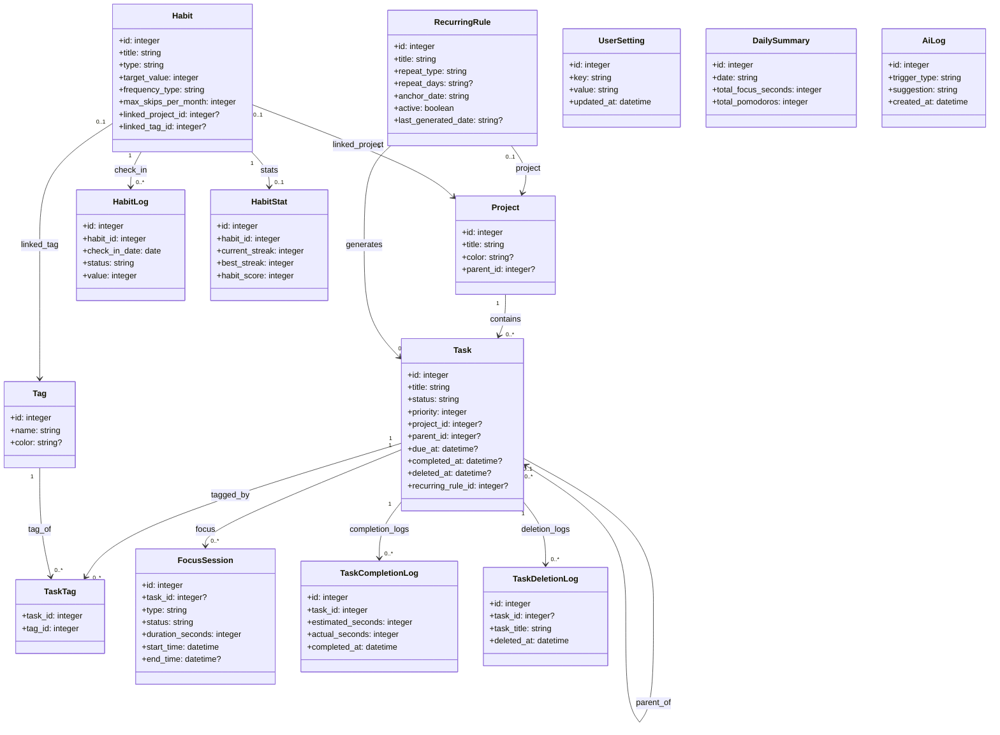

# 智能专注追踪应用 - 设计文档

## 文档信息
- **项目名称**：智能专注追踪应用 (Smart Focus Tracker)
- **文档版本**：v1.2
- **创建日期**：2026-01-17
- **文档类型**：设计文档

---

## 1. 技术栈

### 1.1 整体架构

```
┌─────────────────────────────────────────────┐
│         前端 (Vue 3 + TypeScript)          │
├─────────────────────────────────────────────┤
│  组件层 │  视图层 │  状态管理 (Pinia)  │
└────────────────────┬────────────────────────┘
                     │
┌────────────────────▼────────────────────────┐
│         Tauri 应用层 (Rust)                 │
├─────────────────────────────────────────────┤
│  Tauri Commands │  数据库操作 │  通知服务   │
└────────────────────┬────────────────────────┘
                     │
┌────────────────────▼────────────────────────┐
│         数据层 (SQLite)                       │
└─────────────────────────────────────────────┘
```

### 1.2 技术选型

| 组件 | 技术选择 | 理由 |
|-----|---------|------|
| **核心框架** | Tauri 2.0 | 最新稳定版，跨平台桌面应用，体积小、性能高 |
| **前端框架** | Vue 3 + TypeScript | 现代化、类型安全，Vite 提供极快的开发体验 |
| **状态管理** | Pinia | Vue 3 官方推荐，类型安全、零样板代码 |
| **数据库** | SQLite（Rust 侧访问：rusqlite/sqlx） | Rust 统一读写边界，便于同步、锁与数据一致性管理 |
| **图表库** | Vue-ECharts | 功能强大，支持热力图等复杂可视化 |
| **通知系统** | tauri-plugin-notification | 原生系统通知 |
| **AI 集成** | 云端 API (OpenAI/兼容接口) | 灵活选择模型，易于扩展 |
| **WebDAV 同步** | 原生 HTTP/WebDAV 库 | 标准协议，支持坚果云、Nextcloud 等 |
| **压缩/解压** | Rust zip 库 | 本地压缩上传，下载后自动解压 |
| **UI 框架** | Tailwind CSS | 快速开发，Tauri 兼容性好 |

---

## 1.3 开发优先级说明

> **重要说明**：AI 智能模块作为最后一阶段开发，确保基础功能稳定、数据积累充分后再集成 AI 能力。

### 开发顺序

| 阶段 | 内容 | 优先级 |
|-----|------|-------|
| **P0 核心功能** | 项目初始化、数据库设计、任务 CRUD、番茄钟计时器、本地数据持久化、系统通知 | 最高 |
| ~~**P1 习惯模块**~~ | ~~习惯 CRUD、打卡、统计、热力图、跳过机制~~ | ~~高~~ |
| **P2 数据可视化** | 统计卡片、热力图、时间轴、趋势图表、详情页 | 高 |
| **P3 云同步** | WebDAV 配置、压缩上传、下载解压、自动同步、冲突解决 | 中 |
| **P4 AI 智能模块** | AI 触发引擎、场景化提示、分析报告、周期性分析 | 低（最后开发） |

### 为什么 AI 模块最后开发？

1. **数据基础**：需要积累足够的任务、番茄钟、~~习惯~~数据才能提供有意义的 AI 分析
2. **用户体验**：确保基础功能稳定可靠，AI 才是锦上添花而非干扰
3. **成本控制**：避免早期频繁调用 AI API 增加开发成本
4. **需求验证**：先验证用户对基础功能的使用情况，再决定 AI 功能的具体价值

---

## 2. 项目结构

```
src-tauri/                      # Rust 后端
├── capabilities/               # Tauri v2 权限配置
│   └── default.json
├── src/
│   ├── commands/               # Tauri 命令（前后端通信）
│   ├── db/                     # 数据库操作
│   ├── services/               # Rust 服务层
│   └── lib.rs                  # 插件注册
├── Cargo.toml                  # Rust 依赖
└── tauri.conf.json             # Tauri 配置

src/                            # Vue 前端
├── assets/                     # 静态资源
├── components/
│   ├── charts/                 # ECharts 图表组件
│   ├── task/                   # 任务相关组件
│   ├── ~~habit/~~              # 习惯相关组件（暂缓）
│   ├── timer/                  # 番茄钟组件
│   └── ui/                     # 基础 UI 组件
├── composables/                # 组合式函数
├── router/                     # Vue Router 路由配置
├── services/
│   ├── ai/                     # AI 服务
│   ├── commands/               # invoke 封装（前端不直连 DB）
│   └── notification.ts         # 通知封装
├── stores/                     # Pinia 状态管理
│   ├── taskStore.ts
│   ├── ~~habitStore.ts~~
│   ├── timerStore.ts
│   └── settingsStore.ts
├── types/                      # TypeScript 类型定义
├── utils/                      # 工具函数
│   ├── date.ts                # 日期格式化
│   ├── validation.ts          # 输入验证
│   └── constants.ts          # 全局常量
├── views/                      # 页面视图
├── App.vue
└── main.ts

package.json
tsconfig.json
vite.config.ts
tailwind.config.js
```

---

## 3. 数据库设计

### 3.1 数据库表结构

#### 3.1.1 用户设置表 (user_settings)
```sql
CREATE TABLE user_settings (
    id INTEGER PRIMARY KEY AUTOINCREMENT,
    key TEXT UNIQUE NOT NULL,
    value TEXT NOT NULL,
    updated_at DATETIME DEFAULT CURRENT_TIMESTAMP
);

-- 示例数据
-- {"focus_duration": 25, "short_break": 5, "long_break": 15}
-- {"ai_enabled": true, "ai_task_creation": true, "ai_efficiency_alert": false}
-- {"webdav": {"url": "https://example.com/webdav/", "username": "user", "password": "***", "auto_sync": true, "sync_interval": 30}}
```

#### 3.1.2 项目表 (projects)
```sql
CREATE TABLE projects (
    id INTEGER PRIMARY KEY AUTOINCREMENT,
    title TEXT NOT NULL,
    color TEXT,
    icon TEXT,
    parent_id INTEGER,
    created_at DATETIME DEFAULT CURRENT_TIMESTAMP,
    updated_at DATETIME DEFAULT CURRENT_TIMESTAMP,
    FOREIGN KEY (parent_id) REFERENCES projects(id) ON DELETE SET NULL
);
```

#### 3.1.3 标签表 (tags)
```sql
CREATE TABLE tags (
    id INTEGER PRIMARY KEY AUTOINCREMENT,
    name TEXT NOT NULL,
    color TEXT,
    created_at DATETIME DEFAULT CURRENT_TIMESTAMP
);
```

#### 3.1.4 任务表 (tasks)
```sql
CREATE TABLE tasks (
    id INTEGER PRIMARY KEY AUTOINCREMENT,
    title TEXT NOT NULL,
    status TEXT NOT NULL DEFAULT 'todo', -- todo | in_progress | done | cancelled
    priority INTEGER DEFAULT 0, -- 0: 无 | 1: 低 | 2: 中 | 3: 高

    -- 关联关系
    project_id INTEGER,
    parent_id INTEGER,

    -- 时间信息
    due_at DATETIME,                 -- 本次截止日期（当前实现按天存储，格式 YYYY-MM-DD）
    reminder_time DATETIME,          -- 提醒时间（具体日期时间）
    completed_at DATETIME,
    deleted_at DATETIME,               -- 软删除时间（用于10秒撤销窗口）

    -- 备注
    notes TEXT,                      -- 任务备注（多行文本）

    -- 番茄钟相关（每个任务自定义）
    pomodoro_count INTEGER DEFAULT 1, -- 番茄个数
    pomodoro_duration INTEGER DEFAULT 25, -- 每个番茄的时间（分钟）

    -- 排序
    sort_order INTEGER DEFAULT 0,    -- 清单内拖拽排序顺序（自定义排序使用）

    -- 重复规则关联
    recurring_rule_id INTEGER,       -- 关联 recurring_rules 表（由调度生成器写入）

    -- 创建与更新
    created_at DATETIME DEFAULT CURRENT_TIMESTAMP,
    updated_at DATETIME DEFAULT CURRENT_TIMESTAMP,

    FOREIGN KEY (project_id) REFERENCES projects(id) ON DELETE SET NULL,
    FOREIGN KEY (parent_id) REFERENCES tasks(id) ON DELETE CASCADE,
    FOREIGN KEY (recurring_rule_id) REFERENCES recurring_rules(id) ON DELETE SET NULL
);
```

**重复任务（模板表 + 调度生成方案）**
- 重复任务使用独立的 `recurring_rules` 模板表管理规则
- 任务通过 `recurring_rule_id` 外键关联到规则
- 启用重复时，要求任务 `due_at` 非空，并将其作为规则 `anchor_date`
- 应用启动时（`app_init`）自动为活跃规则增量生成缺失任务（`last_generated_date + 1` 到当天）
- 支持类型：`daily`（每天）、`weekdays`（工作日）、`weekly`（每周）、`monthly`（每月）、`custom`（自定义周几）
- 月度规则遇到不存在的日期则取月末
- 若同一规则同一 `due_at` 已存在任务（且未软删除），则跳过创建
- 任务完成/取消不直接触发“立即生成下一条”，由规则调度统一生成
- 取消重复 = 停用规则（`active = 0`），已生成的任务不受影响

#### 3.1.4.1 重复规则表 (recurring_rules)
```sql
CREATE TABLE recurring_rules (
    id INTEGER PRIMARY KEY AUTOINCREMENT,
    title TEXT NOT NULL,
    description TEXT,
    priority INTEGER DEFAULT 0,
    project_id INTEGER,
    repeat_type TEXT NOT NULL,       -- 'daily' | 'weekdays' | 'weekly' | 'monthly' | 'custom'
    repeat_days TEXT,                -- custom 类型时的 JSON 数组，如 '[1,3,5]'（1=周一..7=周日）
    anchor_date TEXT NOT NULL,       -- 锚点日期 YYYY-MM-DD，用于 weekly/monthly 匹配
    reminder_time TEXT,
    notes TEXT,
    pomodoro_count INTEGER DEFAULT 1,
    pomodoro_duration INTEGER DEFAULT 25,
    active BOOLEAN DEFAULT 1,
    last_generated_date TEXT,        -- 最后生成日期，用于增量生成
    created_at DATETIME DEFAULT CURRENT_TIMESTAMP,
    updated_at DATETIME DEFAULT CURRENT_TIMESTAMP,
    FOREIGN KEY (project_id) REFERENCES projects(id) ON DELETE SET NULL
);
```

#### 3.1.5 任务-标签关联表 (task_tags)
```sql
CREATE TABLE task_tags (
    task_id INTEGER NOT NULL,
    tag_id INTEGER NOT NULL,
    created_at DATETIME DEFAULT CURRENT_TIMESTAMP,
    PRIMARY KEY (task_id, tag_id),
    FOREIGN KEY (task_id) REFERENCES tasks(id) ON DELETE CASCADE,
    FOREIGN KEY (tag_id) REFERENCES tags(id) ON DELETE CASCADE
);
```

#### 3.1.6 专注记录表 (focus_sessions)
```sql
CREATE TABLE focus_sessions (
    id INTEGER PRIMARY KEY AUTOINCREMENT,
    task_id INTEGER,
    start_time DATETIME NOT NULL,
    end_time DATETIME,
    duration_seconds INTEGER NOT NULL,
    type TEXT NOT NULL, -- pomodoro | short_break | long_break
    status TEXT NOT NULL, -- completed | abandoned

    -- 中断信息
    interruption_reason TEXT,

    -- 会话元数据
    pomodoro_count INTEGER DEFAULT 1,

    created_at DATETIME DEFAULT CURRENT_TIMESTAMP,

    FOREIGN KEY (task_id) REFERENCES tasks(id) ON DELETE SET NULL
);
```

#### 3.1.7 AI 日志表 (ai_logs)
```sql
CREATE TABLE ai_logs (
    id INTEGER PRIMARY KEY AUTOINCREMENT,
    trigger_type TEXT NOT NULL, -- task_creation | daily_plan | task_stagnation | efficiency_alert
    context TEXT,
    suggestion TEXT NOT NULL,
    user_action TEXT, -- accepted | rejected | ignored
    user_feedback TEXT,
    created_at DATETIME DEFAULT CURRENT_TIMESTAMP
);
```

#### 3.1.7.1 通知历史表 (notification_logs)
为对齐 `REQUIREMENTS.md` 的“通知中心保存历史通知”诉求，建议将通知历史持久化到本地 SQLite。

```sql
CREATE TABLE notification_logs (
    id INTEGER PRIMARY KEY AUTOINCREMENT,
    type TEXT NOT NULL,                 -- pomodoro_start | pomodoro_end | break_end | task_due | habit_reminder | ai_suggestion
    title TEXT NOT NULL,
    body TEXT NOT NULL,
    payload TEXT,                       -- JSON 字符串：用于跳转参数（task_id、habit_id 等）

    is_read BOOLEAN DEFAULT 0,
    read_at DATETIME,

    created_at DATETIME DEFAULT CURRENT_TIMESTAMP
);

CREATE INDEX idx_notification_logs_created_at ON notification_logs(created_at);
CREATE INDEX idx_notification_logs_type_created_at ON notification_logs(type, created_at);
CREATE INDEX idx_notification_logs_is_read_created_at ON notification_logs(is_read, created_at);
```

#### 3.1.8 任务完成日志表 (task_completion_logs)
```sql
CREATE TABLE task_completion_logs (
    id INTEGER PRIMARY KEY AUTOINCREMENT,
    task_id INTEGER NOT NULL,
    task_title TEXT NOT NULL,

    -- 时间信息
    estimated_seconds INTEGER NOT NULL,     -- 预估时间（番茄数 × 番茄时长）
    actual_seconds INTEGER NOT NULL,         -- 实际时间（所有番茄钟总时长）
    deviation_percentage REAL,               -- 偏差百分比：(|实际 - 预估| / 预估) × 100

    -- 偏差原因
    deviation_reason TEXT,                   -- 偏差原因：估算不准确 | 外部干扰 | 任务变更 | 其他

    -- 心得体会
    reflection TEXT,                        -- 本次任务的困难点
    next_improvement TEXT,                   -- 下次改进的建议
    personal_notes TEXT,                     -- 个人感受和体会

    -- 元数据
    completed_at DATETIME NOT NULL,
    created_at DATETIME DEFAULT CURRENT_TIMESTAMP,

    FOREIGN KEY (task_id) REFERENCES tasks(id) ON DELETE CASCADE
);
```

#### 3.1.9 任务删除日志表 (task_deletion_logs)
```sql
CREATE TABLE task_deletion_logs (
    id INTEGER PRIMARY KEY AUTOINCREMENT,
    task_id INTEGER,                         -- 可为空，任务删除后保留日志
    task_title TEXT NOT NULL,

    -- 元数据
    deleted_at DATETIME NOT NULL,
    created_at DATETIME DEFAULT CURRENT_TIMESTAMP
    -- 注意：不使用外键约束，因为删除日志需要在任务删除后保留
    -- 注意：不记录删除原因，简化用户操作流程
);
```

**软删除与撤销（10 秒窗口）**
- 删除任务时，不立即物理删除：写入 `tasks.deleted_at = now()`，并插入一条 `task_deletion_logs`
- 列表查询默认过滤 `deleted_at IS NULL`，因此 UI 视角表现为“已删除”
- 撤销：将 `deleted_at` 置空，并恢复其子任务（同样置空）
- 超过 10 秒：后台清理 `deleted_at <= now() - 10s` 的任务（物理删除会触发关联表的 `ON DELETE CASCADE`）

#### 3.1.10 每日汇总表 (daily_summaries)
```sql
CREATE TABLE daily_summaries (
    id INTEGER PRIMARY KEY AUTOINCREMENT,
    date TEXT UNIQUE NOT NULL, -- YYYY-MM-DD

    -- 统计数据
    total_focus_seconds INTEGER DEFAULT 0,
    total_pomodoros INTEGER DEFAULT 0,
    tasks_completed INTEGER DEFAULT 0,
    tasks_created INTEGER DEFAULT 0,
    interruptions INTEGER DEFAULT 0,

    -- 附加数据 (JSON)
    hourly_distribution TEXT,

    created_at DATETIME DEFAULT CURRENT_TIMESTAMP,
    updated_at DATETIME DEFAULT CURRENT_TIMESTAMP
);
```

#### 3.1.11 ~~习惯表 (habits)（暂缓）~~
```sql
CREATE TABLE habits (
    id INTEGER PRIMARY KEY AUTOINCREMENT,
    title TEXT NOT NULL,
    description TEXT,
    icon TEXT,                          -- Emoji 或预设图标名
    color TEXT,                         -- 颜色 Hex 值

    -- 习惯类型
    type TEXT NOT NULL,                 -- 'boolean' | 'count' | 'duration'
    target_value INTEGER DEFAULT 1,     -- 目标值（计数型：次数，时长型：分钟）
    target_unit TEXT,                   -- 'times' | 'minutes' | 'ml' | 'pages' 等

    -- 频率规则
    frequency_type TEXT NOT NULL,       -- 'daily' | 'weekly' | 'specific_days'
    frequency_value INTEGER,            -- weekly 时表示每周几次
    frequency_days TEXT,                -- specific_days 时的 JSON，如 '[1,3,5]' 表示周一三五

    -- 跳过限制
    max_skips_per_month INTEGER DEFAULT 3, -- 每月最大跳过次数（可配置1-5）

    -- 番茄钟关联（时长型习惯可用）
    linked_to_pomodoro BOOLEAN DEFAULT 0,
    linked_project_id INTEGER,          -- 关联特定清单的番茄钟
    linked_tag_id INTEGER,              -- 关联特定标签的番茄钟

    -- 提醒
    reminder_enabled BOOLEAN DEFAULT 0,
    reminder_time TEXT,                 -- 提醒时间 'HH:MM'

    -- 状态
    archived BOOLEAN DEFAULT 0,
    created_at DATETIME DEFAULT CURRENT_TIMESTAMP,
    updated_at DATETIME DEFAULT CURRENT_TIMESTAMP,

    FOREIGN KEY (linked_project_id) REFERENCES projects(id) ON DELETE SET NULL,
    FOREIGN KEY (linked_tag_id) REFERENCES tags(id) ON DELETE SET NULL
);
```

#### 3.1.12 习惯打卡记录表 (habit_logs)
```sql
CREATE TABLE habit_logs (
    id INTEGER PRIMARY KEY AUTOINCREMENT,
    habit_id INTEGER NOT NULL,
    check_in_date DATE NOT NULL,        -- 打卡日期 YYYY-MM-DD

    -- 打卡状态
    status TEXT NOT NULL,               -- 'completed' | 'skipped' | 'missed'
    value INTEGER DEFAULT 1,            -- 实际完成值（计数型/时长型）

    -- 跳过原因（可选）
    skip_reason TEXT,

    created_at DATETIME DEFAULT CURRENT_TIMESTAMP,

    FOREIGN KEY (habit_id) REFERENCES habits(id) ON DELETE CASCADE,
    UNIQUE (habit_id, check_in_date)    -- 每个习惯每天只能有一条记录
);

-- 索引优化查询
CREATE INDEX idx_habit_logs_habit_date ON habit_logs(habit_id, check_in_date);
CREATE INDEX idx_habit_logs_date ON habit_logs(check_in_date);
```

#### 3.1.13 习惯统计缓存表 (habit_stats)
```sql
CREATE TABLE habit_stats (
    id INTEGER PRIMARY KEY AUTOINCREMENT,
    habit_id INTEGER NOT NULL UNIQUE,

    -- 连续天数
    current_streak INTEGER DEFAULT 0,   -- 当前连续天数
    best_streak INTEGER DEFAULT 0,      -- 最佳连续天数
    
    -- 本月统计
    month_completed INTEGER DEFAULT 0,  -- 本月完成次数
    month_skipped INTEGER DEFAULT 0,    -- 本月跳过次数
    month_total INTEGER DEFAULT 0,      -- 本月应完成次数

    -- 习惯强度（0-100）
    habit_score INTEGER DEFAULT 0,      -- 基于近30天完成率计算

    -- 总计
    total_completed INTEGER DEFAULT 0,  -- 总完成次数

    -- 元数据
    last_check_in_date DATE,            -- 最后打卡日期
    updated_at DATETIME DEFAULT CURRENT_TIMESTAMP,

    FOREIGN KEY (habit_id) REFERENCES habits(id) ON DELETE CASCADE
);
```

### 3.2 数据库迁移策略

#### 迁移定义
数据库迁移由 **Rust 侧统一执行**，前端不直接连接 SQLite，也不负责跑迁移。

- 使用 `PRAGMA user_version` 作为 schema 版本号
- 迁移按 `version` 升序执行，每个版本是一段 SQL（可拆分成多段执行）

```rust
// src-tauri/src/db/migrations.rs
pub struct Migration {
    pub version: u32,
    pub sql: &'static str,
}

pub const MIGRATIONS: &[Migration] = &[
    Migration { version: 1, sql: "/* ... */" },
    // ...
];
```

#### 迁移执行器
应用启动阶段（注册 commands 前）打开数据库并执行迁移，失败则阻止继续运行，避免出现“前端逻辑已启动但 schema 未就绪”的不一致状态。

```rust
// src-tauri/src/db/mod.rs
use rusqlite::{Connection, Result};

use crate::db::migrations::MIGRATIONS;

pub fn run_migrations(conn: &Connection) -> Result<()> {
    let current_version: u32 = conn.query_row("PRAGMA user_version", [], |row| row.get(0))?;

    let tx = conn.transaction()?;
    for m in MIGRATIONS.iter().filter(|m| m.version > current_version) {
        tx.execute_batch(m.sql)?;
        tx.execute(&format!("PRAGMA user_version = {}", m.version), [])?;
    }
    tx.commit()?;
    Ok(())
}
```

---

## 3.3 领域模型类图

> 说明：基于数据库表结构，抽象出核心领域对象与主要关系，用于统一认知与沟通。



---

## 4. AI 集成设计

### 4.1 AI 架构

```
┌─────────────────────────────────────────────┐
│           前端触发层                          │
│  (用户操作 / 定时任务 / 事件监听)             │
└────────────────────┬────────────────────────┘
                     │
┌────────────────────▼────────────────────────┐
│           AI 触发引擎                          │
│  (识别触发场景 → 构建上下文)                  │
└────────────────────┬────────────────────────┘
                     │
┌────────────────────▼────────────────────────┐
│           AI 提示词构建器                      │
│  (组装历史数据 + 当前状态 + 分析目标)          │
└────────────────────┬────────────────────────┘
                     │
┌────────────────────▼────────────────────────┐
│           AI API 调用器                       │
│  (调用云端 API，处理重试、错误)                │
└────────────────────┬────────────────────────┘
                     │
┌────────────────────▼────────────────────────┐
│           AI 响应解析器                        │
│  (解析 JSON 结构，提取建议)                   │
└────────────────────┬────────────────────────┘
                     │
┌────────────────────▼────────────────────────┐
│           UI 交互层                          │
│  (填充表单 / 弹窗提示 / 生成报告)              │
└─────────────────────────────────────────────┘
```

### 4.2 AI 上下文构建

```typescript
interface AIContext {
  recentTasks: {
    id: number;
    title: string;
    tags: string[];
    estimatedPomodoros: number;
    actualPomodoros: number;
  }[];

  currentTask?: {
    title: string;
    description?: string;
  };

  userStats: {
    avgPomodorosPerTask: number;
    mostUsedTags: string[];
    mostProductiveHour: number;
    completionRate: number;
  };

  triggerType: 'task_creation' | 'daily_plan' | 'task_stagnation' | 'efficiency_alert';
}
```

### 4.3 AI 提示词示例

#### 任务创建建议
```typescript
const TASK_CREATION_PROMPT = `
你是一个智能任务助手。请根据用户的历史任务和统计数据，为当前任务提供建议。

## 历史任务示例
{{recentTasks}}

## 用户统计
- 平均每个任务: {{avgPomodoros}} 番茄
- 常用标签: {{commonTags}}
- 最高效时段: {{mostProductiveHour}}:00
- 任务完成率: {{completionRate}}%

## 当前任务
标题: {{title}}
描述: {{description}}

请以 JSON 格式返回建议：
{
  "suggestedDescription": "详细的任务描述",
  "suggestedTags": ["标签1", "标签2"],
  "suggestedPomodoros": 3,
  "reason": "建议理由"
}
`;
```

### 4.4 AI 响应示例
```json
{
  "suggestedDescription": "完成需求文档的第三章功能需求部分，包括详细的用户故事和验收标准。",
  "suggestedTags": ["毕设", "文档"],
  "suggestedPomodoros": 4,
  "reason": "根据历史数据，类似文档编写任务平均需要 3-4 个番茄，建议加上 #毕设 和 #文档 标签便于统计。"
}
```

---

## 5. WebDAV 云同步设计

### 5.1 WebDAV 架构

```
┌─────────────────────────────────────────────┐
│         前端同步层                          │
├─────────────────────────────────────────────┤
│  手动同步 │ 自动同步 │ 冲突解决          │
└────────────────────┬────────────────────────┘
                     │
┌────────────────────▼────────────────────────┐
│         Tauri 同步服务 (Rust)                 │
├─────────────────────────────────────────────┤
│  WebDAV 客户端 │ 压缩/解压 │ 状态管理    │
└────────────────────┬────────────────────────┘
                     │
┌────────────────────▼────────────────────────┐
│         WebDAV 服务器                         │
│  (坚果云 / Nextcloud / 自建服务器)           │
└─────────────────────────────────────────────┘
```

### 5.2 数据同步策略

#### 同步方式
```typescript
// services/sync/types.ts
export type SyncMode = 'manual' | 'auto';

export interface WebDAVConfig {
  url: string;           // WebDAV 服务器地址
  username: string;       // 用户名
  password: string;       // 密码（加密存储）
  path: string;          // 同步路径（如 /tracker/）
  autoSync: boolean;      // 是否自动同步
  syncInterval: number;   // 同步间隔（分钟）
}

export interface SyncStatus {
  lastSyncTime: Date | null;
  lastSyncResult: 'success' | 'failed' | 'none';
  isSyncing: boolean;
  pendingApply: boolean;      // 是否有待应用的云端数据（等待安全点替换）
  localModifiedAt: Date;
  remoteModifiedAt: Date;
}
```

#### 压缩上传流程
```rust
// src-tauri/src/services/sync.rs
use std::fs;
use std::path::Path;

pub async fn upload_data(config: &WebDAVConfig) -> Result<(), SyncError> {
    // 1. 压缩本地数据库
    let db_path = Path::new("tracker.db");
    let zip_path = Path::new("tracker_backup.zip");

    compress_to_zip(&db_path, &zip_path)?;

    // 2. 上传到 WebDAV
    webdav_upload(&config, &zip_path, "/tracker/tracker_backup.zip").await?;

    // 3. 删除临时文件
    fs::remove_file(&zip_path)?;

    Ok(())
}
```

#### 下载解压流程
```rust
// src-tauri/src/services/sync.rs
pub async fn download_data(config: &WebDAVConfig) -> Result<(), SyncError> {
    // 1. 从 WebDAV 下载压缩文件
    let remote_path = "/tracker/tracker_backup.zip";
    let local_zip = Path::new("tracker_backup.zip");

    webdav_download(&config, remote_path, &local_zip).await?;

    // 2. 解压文件
    let temp_dir = Path::new("temp_sync");
    extract_zip(&local_zip, &temp_dir)?;

    // 3. 冲突检测
    let local_modified = get_file_modified_time("tracker.db")?;
    let remote_modified = get_remote_modified_time(config, remote_path).await?;

    if local_modified > remote_modified {
        // 本地较新，询问用户
        return Err(SyncError::Conflict);
    }

    // 4. 替换本地数据库（仅在安全点执行）
    //    - 若存在运行中的番茄钟：不立即替换，写入暂存并标记 pendingApply
    //    - 安全点：番茄钟结束/放弃后再执行替换
    apply_db_if_safe_point(temp_dir.join("tracker.db"))?;

    // 5. 清理临时文件
    fs::remove_file(&local_zip)?;
    fs::remove_dir_all(&temp_dir)?;

    Ok(())
}
```

### 5.3 冲突解决策略

> **核心原则**：始终让用户选择，不自动覆盖任何数据。

| 冲突场景 | 解决方式 | 用户操作 |
|-----------|---------|---------|
| 本地修改时间 > 云端修改时间 | 提示用户选择 | 用户选择"保留本地"或"使用云端" |
| 云端修改时间 > 本地修改时间 | 提示用户选择 | 用户选择"保留本地"或"使用云端" |
| 修改时间相同但内容不同 | 比较文件 hash，提示用户选择 | 用户选择"保留本地"或"使用云端" |

**冲突对话框内容**：
- 显示本地修改时间和云端修改时间
- 显示文件大小差异（可选）
- 明确的"保留本地"和"使用云端"按钮
- 选择前自动创建本地备份（保留最近 10 个冲突备份）

**备份机制**：
- 冲突解决前自动备份当前本地数据库到 `backups/conflict_YYYYMMDD_HHMMSS.db`
- 保留最近 10 个冲突备份，超出自动删除最旧的

### 5.4 Tauri Commands

```rust
// src-tauri/src/commands/sync.rs
use serde::{Deserialize, Serialize};

#[derive(Debug, Serialize, Deserialize)]
pub struct WebDAVConfig {
    pub url: String,
    pub username: String,
    pub password: String,
    pub path: String,
}

#[tauri::command]
async fn test_webdav_connection(config: WebDAVConfig) -> Result<bool, String> {
    // 测试连接
    Ok(true)
}

#[tauri::command]
async fn manual_sync(config: WebDAVConfig) -> Result<SyncResult, String> {
    // 手动同步
    Ok(SyncResult { status: "success" })
}

#[tauri::command]
async fn get_sync_status() -> Result<SyncStatus, String> {
    // 获取同步状态
    Ok(sync_status)
}

#[tauri::command]
async fn resolve_conflict(use_local: bool) -> Result<(), String> {
    // 解决冲突
    Ok(())
}
```

### 5.5 自动同步实现

```rust
// src-tauri/src/services/scheduler.rs
use tokio::time::{interval, Duration};

pub fn start_auto_sync(config: WebDAVConfig) {
    tokio::spawn(async move {
        let mut interval = interval(Duration::from_secs(config.sync_interval * 60));

        loop {
            interval.tick().await;

            // 后台同步，不阻塞主线程
            if let Err(e) = sync_data(&config).await {
                eprintln!("Auto sync failed: {}", e);
                // 发送通知到前端
                notify_sync_failed();
            }
        }
    });
}
```

### 5.6 前端 Store 扩展

```typescript
// stores/syncStore.ts
import { defineStore } from 'pinia';

export const useSyncStore = defineStore('sync', () => {
  const config = ref<WebDAVConfig | null>(null);
  const status = ref<SyncStatus>({
    lastSyncTime: null,
    lastSyncResult: 'none',
    isSyncing: false,
    localModifiedAt: new Date(),
    remoteModifiedAt: new Date()
  });

  async function testConnection(testConfig: WebDAVConfig) {
    const result = await invoke('test_webdav_connection', { config: testConfig });
    return result;
  }

  async function manualSync() {
    status.value.isSyncing = true;
    try {
      const result = await invoke('manual_sync');
      status.value.lastSyncTime = new Date();
      status.value.lastSyncResult = 'success';
    } catch (e) {
      status.value.lastSyncResult = 'failed';
      throw e;
    } finally {
      status.value.isSyncing = false;
    }
  }

  async function saveConfig(newConfig: WebDAVConfig) {
    config.value = newConfig;
    // 保存到设置
    await saveSetting('webdav_config', newConfig);

    // 启动自动同步
    if (newConfig.autoSync) {
      await invoke('start_auto_sync', { config: newConfig });
    }
  }

  return {
    config,
    status,
    testConnection,
    manualSync,
    saveConfig
  };
});
```

---

## 6. 前端状态管理设计

### 6.1 Pinia Store 模块

| Store | 职责 |
|-------|------|
| **taskStore** | 任务、项目、标签的 CRUD，筛选，排序 |
| ~~**habitStore**~~ | ~~习惯 CRUD，打卡，跳过，统计计算~~ |
| **timerStore** | 番茄钟状态（运行中/暂停/停止），计时器逻辑 |
| **settingsStore** | 用户设置（番茄钟时长、通知、AI 配置） |
| **syncStore** | WebDAV 配置、同步状态、手动同步、自动同步 |

### 6.2 taskStore 示例
```typescript
import { defineStore } from 'pinia';

export const useTaskStore = defineStore('tasks', () => {
  const tasks = ref<Task[]>([]);
  const projects = ref<Project[]>([]);
  const tags = ref<Tag[]>([]);

  const isLoading = ref(false);
  const error = ref<string | null>(null);

  // 派生状态
  const activeTasks = computed(() =>
    tasks.value.filter(t => t.status === 'todo' || t.status === 'in_progress')
  );

  // Actions
  async function fetchTasks() { /* ... */ }
  async function createTask(task: Omit<Task, 'id'>) { /* ... */ }
  async function updateTask(id: number, updates: Partial<Task>) { /* ... */ }
  async function deleteTask(id: number) { /* ... */ }

  return {
    tasks,
    projects,
    tags,
    isLoading,
    error,
    activeTasks,
    fetchTasks,
    createTask,
    updateTask,
    deleteTask
  };
});
```

---

## 7. 路由设计

### 7.1 路由配置
```typescript
// router/index.ts
import { createRouter, createWebHashHistory, type RouteRecordRaw } from 'vue-router';

const routes: RouteRecordRaw[] = [
  {
    path: '/',
    name: 'home',
    component: () => import('@/views/Home.vue')
  },
  {
    path: '/tasks',
    name: 'tasks',
    component: () => import('@/views/Tasks.vue')
  },
  {
    path: '/habits',
    name: 'habits',
    component: () => import('@/views/Habits.vue')
  },
  {
    path: '/timer',
    name: 'timer',
    component: () => import('@/views/Timer.vue')
  },
  {
    path: '/statistics',
    name: 'statistics',
    component: () => import('@/views/Statistics.vue')
  },
  {
    path: '/settings',
    name: 'settings',
    component: () => import('@/views/Settings.vue')
  }
];

const router = createRouter({
  history: createWebHashHistory(),
  routes
});

export default router;
```

---

## 8. TypeScript 类型定义

### 8.1 核心类型
```typescript
interface Task {
  id: number;
  title: string;
  description?: string;
  status: TaskStatus;
  priority: Priority;
  projectId?: number;
  parentId?: number;
  dueAt?: string;
  completedAt?: string;
  deletedAt?: string;
  estimatedPomodoros: number;
  actualPomodoros: number;
  createdAt: string;
  updatedAt: string;
}

type TaskStatus = 'todo' | 'in_progress' | 'done' | 'cancelled';
type Priority = 0 | 1 | 2 | 3;

interface Project {
  id: number;
  title: string;
  color?: string;
  icon?: string;
  parentId?: number;
  createdAt: string;
  updatedAt: string;
}

interface Tag {
  id: number;
  name: string;
  color?: string;
  createdAt: string;
}

interface FocusSession {
  id: number;
  taskId?: number;
  startTime: string;
  endTime?: string;
  durationSeconds: number;
  type: 'pomodoro' | 'short_break' | 'long_break';
  status: 'completed' | 'abandoned';
  interruptionReason?: string;
  createdAt: string;
}

interface WebDAVConfig {
  url: string;
  username: string;
  password: string;
  path: string;
  autoSync: boolean;
  syncInterval: number; // 分钟
}

interface SyncStatus {
  lastSyncTime: Date | null;
  lastSyncResult: 'success' | 'failed' | 'none';
  isSyncing: boolean;
  localModifiedAt: Date;
  remoteModifiedAt: Date;
}

type SyncResult = {
  status: 'success' | 'failed';
  uploaded: number;
  downloaded: number;
  conflicts: number;
};

// ==================== 习惯相关类型 ====================

interface Habit {
  id: number;
  title: string;
  description?: string;
  icon?: string;
  color?: string;

  // 习惯类型
  type: HabitType;
  targetValue: number;        // 目标值
  targetUnit?: string;        // 单位（times/minutes/ml/pages等）

  // 频率规则
  frequencyType: FrequencyType;
  frequencyValue?: number;    // weekly 时每周几次
  frequencyDays?: number[];   // specific_days 时的星期几数组 [1,3,5]

  // 番茄钟关联
  linkedToPomodoro: boolean;
  linkedProjectId?: number;
  linkedTagId?: number;

  // 提醒
  reminderEnabled: boolean;
  reminderTime?: string;      // 'HH:MM'

  // 状态
  archived: boolean;
  createdAt: string;
  updatedAt: string;
}

type HabitType = 'boolean' | 'count' | 'duration';
type FrequencyType = 'daily' | 'weekly' | 'specific_days';

interface HabitLog {
  id: number;
  habitId: number;
  checkInDate: string;        // YYYY-MM-DD
  status: HabitLogStatus;
  value: number;              // 实际完成值
  skipReason?: string;
  createdAt: string;
}

type HabitLogStatus = 'completed' | 'skipped' | 'missed';

interface HabitStats {
  habitId: number;
  currentStreak: number;      // 当前连续天数
  bestStreak: number;         // 最佳连续天数
  monthCompleted: number;     // 本月完成次数
  monthSkipped: number;       // 本月跳过次数
  monthTotal: number;         // 本月应完成次数
  habitScore: number;         // 习惯强度 0-100
  totalCompleted: number;     // 总完成次数
  lastCheckInDate?: string;
}

// 今日习惯视图（包含统计信息）
interface TodayHabit extends Habit {
  stats: HabitStats;
  todayLog?: HabitLog;        // 今日打卡记录（如已打卡）
  todayProgress: number;      // 今日进度（计数型/时长型）
  isCompletedToday: boolean;
  canSkipToday: boolean;      // 本月跳过次数是否未超限
}
```

---

## 9. API 设计 (Tauri Commands)

### 8.2 任务相关
```rust
#[tauri::command]
async fn create_task(task: TaskInput) -> Result<Task, String> { /* ... */ }

#[tauri::command]
async fn update_task(id: i64, updates: TaskUpdates) -> Result<Task, String> { /* ... */ }

#[tauri::command]
async fn delete_task(id: i64) -> Result<(), String> { /* ... */ }

#[tauri::command]
async fn get_tasks(filters: TaskFilters) -> Result<Vec<Task>, String> { /* ... */ }
```

**任务领域约束（Rust commands 必须硬校验）**
- 子任务仅支持一层：`parent_id` 只能为空或指向顶层任务（顶层任务要求 `parent_id IS NULL`）
- 每个父任务最多 50 个子任务（超出返回明确错误）
- 启用重复任务时要求 `due_at` 非空（作为 `anchor_date`，否则返回明确错误）

### 8.3 ~~习惯相关（暂缓）~~
```rust
// 习惯 CRUD
#[tauri::command]
async fn create_habit(habit: HabitInput) -> Result<Habit, String> { /* ... */ }

#[tauri::command]
async fn update_habit(id: i64, updates: HabitUpdates) -> Result<Habit, String> { /* ... */ }

#[tauri::command]
async fn delete_habit(id: i64) -> Result<(), String> { /* ... */ }

#[tauri::command]
async fn archive_habit(id: i64) -> Result<(), String> { /* ... */ }

#[tauri::command]
async fn get_habits(include_archived: bool) -> Result<Vec<Habit>, String> { /* ... */ }

// 打卡相关
#[tauri::command]
async fn check_in_habit(habit_id: i64, value: i32) -> Result<HabitLog, String> { /* ... */ }

#[tauri::command]
async fn skip_habit(habit_id: i64, reason: Option<String>) -> Result<HabitLog, String> { /* ... */ }

#[tauri::command]
async fn get_today_habits() -> Result<Vec<TodayHabit>, String> { /* ... */ }

// 统计相关
#[tauri::command]
async fn get_habit_stats(habit_id: i64) -> Result<HabitStats, String> { /* ... */ }

#[tauri::command]
async fn get_habit_logs(habit_id: i64, start_date: String, end_date: String) -> Result<Vec<HabitLog>, String> { /* ... */ }

#[tauri::command]
async fn recalculate_habit_stats(habit_id: i64) -> Result<HabitStats, String> { /* ... */ }
```

---

## 10. ~~习惯强度计算算法（暂缓）~~

### 9.1 连续天数（Streak）计算

```typescript
// utils/habitCalculations.ts

/**
 * 计算连续天数
 * @param logs 按日期降序排列的打卡记录
 * @returns 当前连续天数
 */
function calculateStreak(logs: HabitLog[]): number {
  let streak = 0;
  const today = new Date();
  today.setHours(0, 0, 0, 0);
  
  for (let i = 0; i < logs.length; i++) {
    const logDate = new Date(logs[i].checkInDate);
    logDate.setHours(0, 0, 0, 0);
    
    const expectedDate = new Date(today);
    expectedDate.setDate(today.getDate() - i);
    
    // 日期不连续，中断
    if (logDate.getTime() !== expectedDate.getTime()) {
      break;
    }
    
    if (logs[i].status === 'completed') {
      streak++;
    } else if (logs[i].status === 'skipped') {
      // 跳过不中断连续，但也不增加
      continue;
    } else {
      // missed 状态中断连续
      break;
    }
  }
  
  return streak;
}
```

### 9.2 习惯强度（Habit Score）计算

```typescript
/**
 * 计算习惯强度 (0-100)
 * 使用指数平滑算法，近期权重更高
 * @param logs 近30天的打卡记录
 * @returns 习惯强度分数
 */
function calculateHabitScore(logs: HabitLog[]): number {
  const WINDOW_DAYS = 30;
  const DECAY_FACTOR = 0.95; // 每天衰减 5%
  
  let weightedSum = 0;
  let weightSum = 0;
  
  const today = new Date();
  today.setHours(0, 0, 0, 0);
  
  for (let i = 0; i < WINDOW_DAYS; i++) {
    const targetDate = new Date(today);
    targetDate.setDate(today.getDate() - i);
    const dateStr = targetDate.toISOString().split('T')[0];
    
    const log = logs.find(l => l.checkInDate === dateStr);
    const weight = Math.pow(DECAY_FACTOR, i); // 越近的日期权重越高
    
    if (log?.status === 'completed') {
      weightedSum += weight;
    }
    // skipped 和 missed 都不加分
    
    weightSum += weight;
  }
  
  return Math.round((weightedSum / weightSum) * 100);
}
```

### 9.3 每周 X 次习惯的连续周计算

```typescript
/**
 * 计算每周 X 次习惯的连续周数
 * @param logs 打卡记录
 * @param targetPerWeek 每周目标次数
 * @returns 连续达标周数
 */
function calculateWeeklyStreak(logs: HabitLog[], targetPerWeek: number): number {
  // 按周分组
  const weeklyGroups = groupLogsByWeek(logs);
  
  let streak = 0;
  for (const week of weeklyGroups) {
    const completedCount = week.filter(l => l.status === 'completed').length;
    if (completedCount >= targetPerWeek) {
      streak++;
    } else {
      break;
    }
  }
  
  return streak;
}
```

---

## 11. 界面设计 (UI/UX)

### 11.1 设计目标
- **简单易用**：核心路径（新增任务 → 开始专注 → 复盘数据）3 次点击内可达。
- **分类直觉**：任务/专注/习惯/统计/设置对应用户心智模型，避免“功能大杂烩”。
- **渐进式呈现**：默认只展示 20% 高频信息，其余通过 Tab/折叠/钻取呈现。
- **一致性**：同类控件与交互在各页面保持一致（筛选条、空状态、钻取面板）。

#### 10.1.1 参考界面补充要点
- 今日页需保留底部悬浮的微型计时器，作为随时返回计时控制的快捷入口。
- 设置页的清单管理区域采用"图标 + 开关 + 自定义标签行"的列表视觉，支持新增/删除自定义清单。
- 任务输入区在占位文案中加入快捷提示（例如"在任务中添加一个任务，按 / 键保存"），提升可发现性。

#### 10.1.2 浮动计时器组件（FloatingTimerWidget）

**功能**：当计时器运行时，在除 `/timer` 页面外的所有页面底部显示迷你计时器控件。

**位置与尺寸**：
- 固定定位：右下角，距离边缘 16px
- 尺寸：宽度 200px，高度 48px
- 层级：z-index 高于页面内容，低于模态框

**显示内容**：
- 当前任务名称（超长截断，最多 15 字符）
- 剩余时间（MM:SS 格式）
- 状态图标：▶️ 运行中 / ⏸️ 已暂停

**交互**：
- 点击组件：跳转到 `/timer` 页面
- 暂停/继续按钮：直接控制计时器，无需跳转
- 关闭按钮（×）：隐藏本次会话的浮动组件（计时器继续运行）

**视觉状态**：
- 运行中：主题色背景，白色文字
- 已暂停：红色边框，闪烁提示
- 休息中：绿色/蓝色背景，显示"休息中"

**显示规则**：
- 仅当 `timerStore.isRunning || timerStore.isPaused` 时显示
- 在 `/timer` 页面自动隐藏（避免重复）
- 用户手动关闭后，本次会话不再显示（下次启动计时器时重新出现）

### 11.2 全局布局与导航

#### 10.2.1 全局框架
- 采用 **左侧固定 Sidebar + 右侧主内容区**。
- Sidebar 保持稳定，避免统计图表增多导致导航膨胀。

#### 10.2.2 Sidebar（一级导航）
- `仪表盘`：数据统计与分析（整合统计功能）。
- `任务`：任务与子任务管理（含智能列表：今天、明天、最近7天、全部、已完成）。
- `清单`：按项目分类管理任务。
- `习惯打卡`：习惯养成与打卡。
- `设置`：配置、同步、数据管理。

> **设计决策**：统计分析功能整合到仪表盘中，不单独设立 Statistics 页面。仪表盘即统计工作区。

### 11.3 信息架构（Information Architecture）

#### 10.3.1 "仪表盘即统计"原则
- 仪表盘作为应用首页，同时承担数据统计与分析职责。
- 内部用 **二级导航（Tabs）** 来承载图表，每个 Tab 回答一个主要问题：
  - `概览`：最近我做得怎么样？（趋势 + 关键指标）
  - `专注分析`：我的专注模式是什么？（时段/分布/会话）
  - `任务分析`：我产出了什么？（完成率/预估准确度/标签分布）
  - `习惯洞察`：我坚持得怎么样？（连续/热力图/达成率）

#### 10.3.2 渐进式披露（Progressive Disclosure）
- 概览只放 **3–5 个高频"英雄组件"**，其余分析通过：
  - 点击图表元素 → 右侧详情面板/弹窗钻取
  - Tab 内折叠区域（高级分析默认收起）

### 11.4 仪表盘（Dashboard）设计细则

#### 10.4.1 页面结构
```
仪表盘
├─ 页面标题 + 时间范围选择器（7d / 14d / 30d）
├─ KPI 卡片（4 个）
├─ Tab 导航栏（概览 | 专注分析 | 任务分析 | 习惯洞察）
└─ Tab 内容区（图表）
```

#### 10.4.2 KPI 卡片（固定显示，不随 Tab 切换）
- **总专注时长**：选定时间范围内的累计专注分钟数
- **完成番茄**：选定时间范围内完成的番茄个数
- **完成任务**：选定时间范围内完成的任务个数
- **习惯完成率**：选定时间范围内的习惯达成百分比

#### 10.4.3 概览 Tab（默认）
目标：回答"最近我是否在正轨上"。
- 专注趋势图（按天：分钟/番茄）
- 任务完成趋势图（按天）
- 时段效率摘要（轻量版：Top 3 时段或"最常专注时段"）

钻取：
- 点击某一天 → 打开右侧"当日详情面板"：该日番茄时间轴 + 完成任务列表 + 中断信息（若有）。

#### 10.4.4 专注分析 Tab
目标：回答"我在什么时候最专注、专注质量如何"。
- 时段效率分布（0–23 小时柱状图）
- 每周趋势（折线图）
- 番茄时间轴（当日会话 timeline，按点击日期切换）

钻取：
- 点击某个小时柱 → 列表展示该小时贡献的会话与任务（右侧面板）。

#### 10.4.5 任务分析 Tab
目标：回答"任务执行与预估能力如何"。
- 任务完成率（完成/未完成/取消/过期）
- 预估 vs 实际（柱状对比 Top N 任务）
- 标签/清单分布（环形图）

钻取：
- 点击标签/清单扇区 → 跳转/联动到任务列表筛选。

#### 10.4.6 习惯洞察 Tab
目标：回答"坚持情况与波动规律"。
- 习惯打卡热力图（GitHub 风格）
- 连续天数统计卡片：当前连续 / 最佳连续 / 习惯强度
- 周达成趋势图

### 11.5 任务页（Tasks）设计要点
- 保持 **列表 + 详情侧栏** 的主结构（TaskDetail 作为右侧详情面板）。
- 子任务仅一层：详情页内 Subtasks 区域展示为 checklist，并显示 `已完成/总数`。
- 详情侧栏提供“开始专注”入口，并在番茄运行时显示计时状态。

### 11.6 专注模式（Focus Mode）设计要点
- `Focus Timer` 支持沉浸式显示：只显示计时器、当前任务、核心控制按钮。
- 运行中禁止切换任务（按 `REQUIREMENTS.md v2.5` 约束），需要切换则先放弃。
- 计时器状态每秒持久化，重启可恢复。
- 暂停超过 30 分钟显示警告提示；暂停超过 2 小时自动放弃（以 `REQUIREMENTS.md v2.5` 为准）。
- 系统休眠恢复时自动扣除休眠时长继续计时（无需用户确认，认真工作时息屏是正常的）。

#### 11.6.1 计时器状态持久化（双写）
为避免“同步替换数据库文件”影响运行中的计时器，并提升崩溃恢复鲁棒性，计时器状态采用双写：

- 本地文件（运行态权威）：`appData/timer_state.json`
- 数据库备份（用于恢复/诊断）：`user_settings.key = 'timer_state'`

**任务标题快照**：
- `timer_state` 中保存 `task_id` 与 `task_title_snapshot`
- 如同步替换数据库后找不到 `task_id`（任务已删除/ID 被覆盖），计时器继续运行，UI 使用 `task_title_snapshot` 展示当前任务
- 写入 `focus_sessions` 时允许 `task_id` 为空（与 `REQUIREMENTS.md` 异常场景对齐）

恢复优先级（确定性口径）：
- 两份都存在时：优先选择 `lastTickAt` 更新的一份
- 只要本地文件显示 `status = running/paused`，则始终优先本地文件（避免被 DB 同步覆盖）

#### 10.6.1 计时器页面状态设计

**状态 1：空闲状态（Idle）**
- 显示内容：
  - 大号时间显示：25:00（默认番茄时长）
  - 提示文字："选择一个任务开始专注"
  - 任务选择器按钮
- 操作：点击"选择任务"打开任务选择弹窗

**状态 2：已选择任务，待开始（Ready）**
- 显示内容：
  - 任务名称（可点击切换）
  - 大号时间显示：25:00（任务配置的番茄时长）
  - 番茄进度：1/3（当前是第几个番茄）
- 操作按钮：
  - "开始专注"（主按钮，绿色）
  - "切换任务"（次要按钮）

**状态 3：运行中（Running）**
- 显示内容：
  - 任务名称（不可点击，灰色）
  - 倒计时动画：MM:SS（每秒更新）
  - 进度环：显示已用时间百分比
  - 番茄进度：1/3
- 操作按钮：
  - "暂停"（主按钮）
  - "放弃"（次要按钮，需确认）
- 视觉：主题色背景渐变

**状态 4：已暂停（Paused）**
- 显示内容：
  - 任务名称
  - 时间显示（闪烁动画）
  - 已暂停时长：已暂停 05:30
  - 警告提示：暂停超过 30 分钟显示警告，超过 2 小时将自动放弃
- 操作按钮：
  - "继续"（主按钮，绿色）
  - "放弃"（次要按钮）
- 视觉：红色边框/警告色调

**状态 5：短休息（Short Break）**
- 显示内容：
  - "休息一下！"标题
  - 倒计时：05:00
  - 下一个番茄预览
- 操作按钮：
  - "跳过休息"
- 视觉：绿色/蓝色放松色调

**状态 6：长休息（Long Break）**
- 显示内容：
  - "🎉 完成 4 个番茄！"
  - 倒计时：15:00
  - 今日统计摘要
- 操作按钮：
  - "跳过休息"
- 视觉：更深的放松色调

**状态 7：番茄完成（Completed）**
- 显示内容：
  - 庆祝动画（短暂）
  - "专注完成！"
  - 本次专注时长统计
- 自动转换：2秒后自动进入休息状态

### 11.7 设置页（Settings）信息分组
- 采用纵向分组或二级 Tabs（建议）：
  - `General` / `Timer` / `Notifications` / `AI` / `Data & Sync`
- 重点：WebDAV 同步需要"状态可见"（最近一次同步结果、失败原因、冲突入口）。

#### 10.7.1 同步状态 UI 设计

**全局同步状态指示器**（位于 Sidebar 底部）：
- 图标状态：
  - ☁️ 未配置同步
  - 🔄 同步中（旋转动画）
  - ✅ 同步成功（显示 3 秒后恢复为云图标）
  - ⚠️ 同步失败（红色，点击查看详情）
  - 🔶 存在冲突（橙色，点击解决）
- 悬停显示：最后同步时间

**Settings - Data & Sync 页面**：
- 同步状态卡片：
  - 最后同步时间：2026-01-18 10:30:00
  - 同步状态：成功 / 失败 / 冲突
  - 本地修改时间 vs 云端修改时间
- 操作按钮：
  - "立即同步"（主按钮）
  - "上传到云端"（覆盖云端）
  - "从云端下载"（覆盖本地）
- 同步进度条：上传/下载时显示进度百分比
- 错误信息：失败时显示具体原因 + "重试"按钮

**冲突解决对话框**：
- 标题："检测到数据冲突"
- 内容：
  - 本地版本：修改时间 + 文件大小
  - 云端版本：修改时间 + 文件大小
- 按钮：
  - "保留本地版本"（主按钮）
  - "使用云端版本"
  - "取消"
- 说明文字："选择前会自动备份当前数据"

#### 11.7.2 数据管理（导出/导入/清空/自动备份）
目标：对齐 `REQUIREMENTS.md` 的数据管理与数据存储诉求，提供可恢复、可迁移、可自助排障的能力。

**导出数据**
- 导出格式：JSON（必选），CSV（可选，面向表格分析）
- 导出行为：由 Rust 侧读取 SQLite 并生成文件，前端仅负责选择保存路径与展示结果

**导入数据**
- 支持从 JSON 备份导入
- 导入前自动创建本地备份（避免误操作导致不可恢复）
- 导入建议采用“替换导入”（清空后导入）以降低 merge 复杂度；如需要 merge 需再定义冲突规则

**清空数据（危险操作）**
- 多次确认后执行
- 由 Rust 侧完成：关闭 DB 连接 -> 备份（可选）-> 删除 DB 文件 -> 重新初始化并跑 migrations

**每日自动备份**
- 备份触发：每日 1 次（本地时间），或在应用启动时补一次（如当天未备份）
- 保留策略：保留最近 7 份，超出自动删除最旧的
- 备份路径：`appData/backups/daily_YYYYMMDD.db`

### 11.8 图表与数据性能约束（实现导向）
- **按路由/Tab 懒加载**：Statistics 的每个 Tab 使用异步组件。
- **图表可见时再挂载**：使用 IntersectionObserver，在进入视口后再渲染 ECharts。
- **避免一图一查询**：按 filters 先聚合取数（SQLite `GROUP BY`），前端仅做轻量整形。
- **缓存策略**：Pinia 里用 `cacheKey = JSON.stringify(filters)` 缓存聚合结果，切换 Tab 不重复计算。
- **默认图表数量控制**：Overview 保持 3 个英雄图；更多内容通过钻取/折叠。

#### 10.8.1 图表加载状态设计

**加载状态**：
- 图表容器显示骨架屏（灰色脉冲动画占位框）
- 骨架屏尺寸与图表预期尺寸一致，避免布局抖动
- 最小高度：200px

**加载失败状态**：
- 显示错误图标 + "加载失败"文字
- 提供"重试"按钮
- 背景：浅灰色，边框：虚线

**无数据状态**：
- 居中显示："暂无数据"或具体提示（如"选定时间范围内没有专注记录"）
- 可选：显示引导用户操作的 CTA 按钮

**图表组件加载顺序**：
1. 先渲染容器骨架屏
2. IntersectionObserver 检测进入视口
3. 异步加载 ECharts 组件
4. 请求数据（显示 loading 状态）
5. 数据返回后渲染图表（带渐入动画）

### 11.9 空状态/错误状态（统一规范）

**空状态规范表**：

| 页面/组件 | 空状态文案 | CTA 按钮 |
|-----------|-----------|----------|
| Dashboard - Up Next | 还没有待办任务 | 添加任务 |
| Tasks - 任务列表 | 还没有任务，点击上方添加你的第一个任务 | - |
| Tasks - 搜索无结果 | 未找到匹配的任务 | 清除搜索 |
| ~~Habits - 习惯列表~~ | ~~创建一个习惯开始培养好习惯~~ | ~~新建习惯~~ |
| Statistics - Overview | 完成一些番茄钟后，这里会显示你的专注数据 | 开始专注 |
| Statistics - Focus | 还没有专注记录 | 开始专注 |
| Statistics - Tasks | 还没有已完成的任务 | 查看任务 |
| ~~Statistics - Habits~~ | ~~还没有习惯打卡记录~~ | ~~查看习惯~~ |
| Timer - 无任务选择 | 选择一个任务开始专注 | 选择任务 |

**错误状态规范**：
- WebDAV 同步失败：显示明确错误原因 + "重试"按钮
- AI 调用失败：静默降级，不阻塞核心流程，可选显示"AI 暂时不可用"提示
- 数据库错误：显示"数据保存失败，请重试"+ "重试"按钮
- 网络不可用：状态栏显示离线图标，AI 功能按钮置灰

#### 10.9.1 逾期任务视觉样式

**逾期判定**：`due_at < now && status !== 'done' && status !== 'cancelled' && deleted_at IS NULL`

**视觉表现**：
- 任务卡片左侧边框：红色 (4px solid #EF4444)
- 截止时间文字：红色，并显示"已逾期"徽章
- 在任务列表中，逾期任务显示在"待办"区域顶部
- Dashboard "Up Next" 中逾期任务优先显示

**排序优先级**：
1. 逾期任务（按逾期天数降序，逾期越久越靠前）
2. 今日截止
3. 按截止时间升序

### 11.10 页面布局（组件级规格）

> 本节强调“可实现的精确”：固定少量关键尺寸（Sidebar/面板/工具条高度），其余用“占据剩余空间 + 明确滚动归属 + 折叠规则”表达，保证文档不会因 UI 小改动而失效。

#### 10.10.1 全局布局 Token（尺寸/间距/滚动）

**窗口尺寸**
- 最小宽度：1024px（低于此进入“受限模式”）
- 推荐宽度：1280–1440px
- 应用根节点占满窗口高度（`h-screen`）

**关键固定尺寸**
- `PrimarySidebar.width = 256px`（对应当前实现 `src/App.vue`）
- `WorkspacePadding = 24px`（页面内容区左右内边距）
- `PageHeader.height = 56px`
- `FilterBar.height = 48px`
- `TabsBar.height = 44px`
- `InspectorPanel.width = 360px`（min 320px, max 420px）

**通用间距（基于 4px 网格）**
- `gap-xs=8px` `gap-sm=12px` `gap-md=16px` `gap-lg=24px` `gap-xl=32px`

**滚动归属（防止双滚动）**
- `PrimarySidebar`：仅当内容溢出时内部滚动
- `MainWorkspace`：默认可滚动（对应 `src/App.vue` 的 main 区域 `overflow-auto`）
- 若页面存在右侧 `InspectorPanel`：`InspectorPanel` 自己可滚动，主区域保持独立

#### 10.10.2 全局 App Shell（包含/并列关系）

**组件树（实现参考：`src/App.vue`）**
```text
App
└─ AppShell (flex row, full height)
   ├─ PrimarySidebar (fixed 256px)
   │  ├─ AppBrand (logo + name)
   │  └─ NavList (RouterLink list)
   └─ MainWorkspace (flex:1, scroll owner)
      └─ RouterView (renders current page)
```

**线框（ASCII）**
```text
┌──────────────────────────────────────────────────────────────────────────────┐
│ AppShell                                                                     │
├──────────── PrimarySidebar (256px) ────────────┬────────── MainWorkspace ────┤
│ Brand                                           │ RouterView                  │
│ ─────────────────────────────────────          │ (page content; scroll)      │
│ NavList                                         │                             │
│  • Dashboard                                    │                             │
│  • Tasks                                        │                             │
│  • Focus Timer                                  │                             │
│  • Statistics                                   │                             │
│  • Settings                                     │                             │
└─────────────────────────────────────────────────┴─────────────────────────────┘
```

#### 10.10.3 桌面缩放（窗口变窄）折叠规则

> 目标：明确“先牺牲什么”，保证可用性。

- **Normal（≥ 1024px）**：Sidebar + Workspace 正常显示；若出现右侧 InspectorPanel，使用固定宽度 360px。
- **Constrained（800–1023px）**：优先将 `InspectorPanel` 从“右侧并列”降级为“右侧抽屉 DrawerOverlay”。
- **Very constrained（< 800px）**：Sidebar 可折叠为 icon-only 或抽屉；Workspace 占满。

#### 10.10.4 Dashboard 页面（`/` / `src/views/Home.vue`）

**实际组件树（当前实现）**
```text
HomeView
└─ PageContainer (maxWidth: 1200px, centered)
   ├─ PageHeaderRow
   │  ├─ TitleBlock (Dashboard + subtitle)
   │  └─ HeaderAction: Button("Generate Daily Plan")
   ├─ StatsGrid (4 cards; 1/2/4 columns depending width)
   └─ BodyGrid (>=lg: 2 columns; else 1)
      ├─ LeftColumn (col-span 2)
      │  ├─ SectionHeaderRow ("Up Next" + link "View All")
      │  └─ TaskList
      │     ├─ TaskItem (repeat; max 3)
      │     └─ EmptyState (centered)
      └─ RightColumn
         └─ FocusCTA Card ("Ready to Focus?" + link to /timer)
   └─ DailyPlanModal (overlay; sibling of PageContainer content)
```

**并列/包含关系线框**
```text
┌──────────────────────── Dashboard (MainWorkspace scroll) ─────────────────────┐
│ [HeaderRow: Title .................] [Button: Generate Daily Plan]             │
│ ───────────────────────────────────────────────────────────────────────────── │
│ StatsGrid (4 cards)                                                           │
│ [Card][Card][Card][Card]                                                      │
│                                                                              │
│ BodyGrid (lg: 2 columns)                                                      │
│ ┌───────────────────────────────────────────┐ ┌────────────────────────────┐ │
│ │ LeftColumn (Up Next)                      │ │ RightColumn                │ │
│ │ [Up Next .............] [View All]        │ │ [Ready to Focus? CTA]      │ │
│ │ • TaskItem                                 │ │                            │ │
│ │ • TaskItem                                 │ │                            │ │
│ │ • TaskItem                                 │ │                            │ │
│ └───────────────────────────────────────────┘ └────────────────────────────┘ │
└──────────────────────────────────────────────────────────────────────────────┘
```

#### 10.10.5 Tasks 页面（`/tasks` / `src/views/Tasks.vue`）

> 说明：本节为规划布局示意（当前仓库为文档快照，不包含可执行源码）。
> 规划：采用三栏布局——左侧 ProjectSidebar（清单过滤）+ 中间 TaskList + 右侧 TaskDetail（详情面板）。

**推荐组件树（规划）**
```text
TasksView
└─ ThreeColumnLayout (flex row, full height)
   ├─ ProjectSidebar (200px, fixed)
   │  ├─ SidebarHeader
   │  │  └─ Title: "清单"
   │  ├─ ProjectList (scroll)
   │  │  ├─ ProjectItem: "全部" (special, always first)
   │  │  ├─ ProjectItem: "收集箱" (special, no project)
   │  │  ├─ Divider
   │  │  └─ ProjectItem* (user projects)
   │  └─ SidebarFooter
   │     └─ AddProjectButton: "+ 新建清单"
   ├─ TaskListRegion (flex:1, scroll)
   │  ├─ HeaderRow
   │  │  ├─ Title: "{projectName}" (or "全部任务")
   │  │  └─ CounterText: "{active} active · {completed} completed"
   │  ├─ TaskInput
   │  ├─ BodyState
   │  │  ├─ LoadingState (when loading and no tasks)
   │  │  ├─ ErrorBanner (when error)
   │  │  └─ Content
   │  │     ├─ Section: To Do
   │  │     │  └─ TaskList
   │  │     │     └─ TaskItem* (click opens detail)
   │  │     ├─ Section: Completed
   │  │     │  └─ TaskList
   │  │     │     └─ TaskItem*
   │  │     └─ EmptyState (when tasks.length==0)
   └─ InspectorPanel (360px, conditional)
      └─ TaskDetail (scroll)
```

**ProjectSidebar 设计规格**

| 属性 | 规格 |
|------|------|
| **宽度** | 200px（固定） |
| **背景** | 比主背景略深（如 gray-50/gray-100） |
| **边框** | 右侧 1px 分隔线 |
| **滚动** | 内部独立滚动（当项目多时） |

**ProjectItem 设计规格**

| 状态 | 样式 |
|------|------|
| **默认** | 左侧项目图标/颜色点 + 项目名称 + 右侧任务计数 |
| **选中** | 背景高亮（primary-50）+ 左侧指示条（primary-500, 3px） |
| **悬停** | 背景变浅（gray-100） |

**特殊项目**：
- "全部"：显示所有任务，图标使用列表图标
- "收集箱"：显示未分配项目的任务，图标使用收集箱图标
- 用户项目：显示项目配置的颜色点和图标

**系统内置清单规则**：
- "收集箱"为系统内置清单：**不可删除、不可改名**
- "全部"为虚拟视图入口：不参与编辑/删除/改名

**项目右键菜单**（用户项目）：
- 编辑清单
- 删除清单（需确认，任务移至收集箱）

**线框（完整三栏布局）**
```text
┌──────────────────────────────────────────────────────────────────────────────┐
│ TasksView (ThreeColumnLayout)                                                │
├─── ProjectSidebar (200px) ───┬─────── TaskListRegion ──────┬── Inspector ───┤
│ [清单]                        │ HeaderRow: {Project} [cnt]  │ TaskDetail     │
│ ────────────────────────────  │ TaskInput                   │  - Title       │
│ • 全部           (12)         │ ───────────────────────────  │  - Status      │
│ • 收集箱          (3)         │ [To Do]                     │  - Priority    │
│ ────────────────────────────  │  • TaskItem ●               │  - Due Date    │
│ • 工作            (5)         │  • TaskItem                 │  - Project     │
│ • 学习            (2)         │  • TaskItem                 │  - Notes       │
│ • 生活            (2)         │ [Completed]                 │  - Subtasks    │
│                              │  • TaskItem ✓               │  - Pomodoro    │
│                              │  • TaskItem ✓               │                │
│ ────────────────────────────  │                             │                │
│ [+ 新建清单]                   │                             │                │
└──────────────────────────────┴─────────────────────────────┴────────────────┘
```

**交互行为**：
1. 点击 ProjectItem → 筛选显示该清单的任务，更新 TaskListRegion 标题
2. 点击任务 → 右侧打开 TaskDetail（如已打开则切换内容）
3. 在 TaskInput 中创建任务 → 自动分配到当前选中的清单（"全部"时分配到"收集箱"）
4. 拖拽任务到 ProjectItem → 移动任务到该清单

**响应式折叠规则**：
- **≥1280px**：三栏全部显示
- **1024-1279px**：ProjectSidebar 收起为图标栏（48px），悬停展开
- **<1024px**：ProjectSidebar 变为抽屉，通过汉堡菜单触发

**推荐布局（引入 InspectorPanel）**
- 当 `TaskDetail` 打开：
  - 左侧 `TaskListRegion` 占据剩余空间
  - 右侧 `InspectorPanel` 固定 360px 并独立滚动

**线框（打开详情时）**
```text
┌──────────────────────────────────────────────────────────────────────────────┐
│ HeaderRow: Tasks ........................................ [counts]            │
│ TaskInput (full width of list region)                                         │
├─────────────────────────────── SplitLayout (gap 24px) ───────────────────────┤
│ ┌───────────────────────────────────────────┐ ┌────────────────────────────┐ │
│ │ TaskListRegion (scroll)                   │ │ InspectorPanel (360px)     │ │
│ │ [To Do]                                   │ │ TaskDetail (scroll)        │ │
│ │  • TaskItem                               │ │  - Title / Status          │ │
│ │  • TaskItem                               │ │  - Fields / Notes          │ │
│ │ [Completed]                               │ │  - Subtasks (1 level)      │ │
│ │  • TaskItem                               │ │  - Pomodoro settings       │ │
│ └───────────────────────────────────────────┘ └────────────────────────────┘ │
└──────────────────────────────────────────────────────────────────────────────┘
```

#### 10.10.6 Focus Timer 页面（`/timer` / `src/views/Timer.vue`）

**实际组件树（当前实现）**
```text
TimerView
└─ CenterContainer (full height; centered)
   ├─ TitleBlock (Focus Timer + subtitle)
   └─ FocusTimer (primary)
```

**尺寸规则**
- `FocusTimer` 容器宽度：min(560px, 100%)，居中
- 页面标题块与计时器之间垂直间距：24px

**线框**
```text
┌──────────────────────── Focus Timer (centered) ──────────────────────────────┐
│ [Title] Focus Timer                                                          │
│ [Subtitle] Stay focused...                                                    │
│                                                                              │
│                     ┌──────────────────────────────┐                         │
│                     │ FocusTimer                    │                         │
│                     │  - Time display               │                         │
│                     │  - Start/Pause/Stop           │                         │
│                     │  - Mode (focus/break)         │                         │
│                     └──────────────────────────────┘                         │
└──────────────────────────────────────────────────────────────────────────────┘
```

#### 10.10.7 Statistics 页面（`/statistics` / `src/views/Statistics.vue`）

> 说明：本节为规划结构示意（当前仓库为文档快照，不包含可执行源码）。
> 规划：Statistics 作为工作区，采用 `Header + FilterBar + TabsBar + TabBody + DrilldownInspector`。

**推荐组件树（规划）**
```text
StatisticsView
└─ WorkspaceColumn
   ├─ PageHeaderRow (56px)
   │  ├─ TitleBlock (Statistics + subtitle)
   │  └─ (optional) ExportButton / Help
   ├─ FilterBar (48px)
   │  ├─ DateRangePicker
   │  ├─ ProjectSelect
   │  ├─ TagMultiSelect
   │  └─ ResetFilters
   ├─ TabsBar (44px)
   │  ├─ Tab: Overview
   │  ├─ Tab: Focus
   │  ├─ Tab: Tasks
   │  ├─ Tab: Habits
   │  └─ Tab: Insights (optional)
   └─ SplitLayout
      ├─ TabBody (scroll)
      │  ├─ Section/CardGrid (charts)
      │  └─ Empty/Loading states centered in TabBody
      └─ DrilldownInspector (conditional, 360px)
         └─ DetailPanel (list of sessions/tasks contributing)
```

**线框（含钻取面板）**
```text
┌──────────────────────────────────────────────────────────────────────────────┐
│ HeaderRow: Statistics ........................................ [Actions]      │
│ FilterBar: [Range] [Project] [Tags] [Reset]                                   │
│ TabsBar:  Overview | Focus | Tasks | Habits | Insights                         │
├────────────────────────────── SplitLayout (gap 24px) ────────────────────────┤
│ ┌───────────────────────────────────────────┐ ┌────────────────────────────┐ │
│ │ TabBody (scroll)                           │ │ DrilldownInspector (360px) │ │
│ │ ┌───────────────────────────────────────┐ │ │ DetailPanel (scroll)       │ │
│ │ │ ChartCard                               │ │ │ - Selected day/hour        │ │
│ │ │  [ActivityChart / Heatmap / Trend ...]  │ │ │ - Sessions list            │ │
│ │ └───────────────────────────────────────┘ │ │ - Tasks list                │ │
│ │ ┌───────────────────────────────────────┐ │ └────────────────────────────┘ │
│ │ │ ChartCard                               │ │                              │
│ │ └───────────────────────────────────────┘ │                              │
│ └───────────────────────────────────────────┘                              │
└──────────────────────────────────────────────────────────────────────────────┘
```

#### 10.10.8 Settings 页面（`/settings` / `src/views/Settings.vue`）

**实际组件树（当前实现）**
```text
SettingsView
└─ PageContainer (maxWidth: 900px, centered)
   ├─ HeaderRow
   │  ├─ TitleBlock (Settings + subtitle)
   │  └─ SaveButton
   └─ SectionStack (vertical)
      ├─ Section: Timer Settings
      │  ├─ FormGrid (3 inputs)
      │  └─ ToggleList (2 checkboxes)
      ├─ Section: WebDAV Sync
      │  ├─ FormGrid (url, username, password, path)
      │  ├─ ActionRow (Test/Upload/Download)
      │  └─ StatusText
      ├─ Section: Notifications
      │  └─ ToggleRow
      └─ Section: Data Management (Danger)
         └─ ActionRow (Reset Data)
```

**并列/包含关系线框**
```text
┌──────────────────────── Settings (scroll) ───────────────────────────────────┐
│ HeaderRow: [Title] .......................................... [Save Changes] │
│                                                                              │
│ SectionStack                                                                 │
│ ┌──────────────── Timer Settings ────────────────┐                            │
│ │ [Pomodoro] [Short Break] [Long Break]          │                            │
│ │ [Auto-start Breaks toggle]                     │                            │
│ │ [Auto-start Pomodoros toggle]                  │                            │
│ └───────────────────────────────────────────────┘                            │
│ ┌──────────────── WebDAV Sync ──────────────────┐                            │
│ │ [Server URL]                                   │                            │
│ │ [Username] [Password]                          │                            │
│ │ [Path]                                         │                            │
│ │ [Test] [Upload] [Download]                     │                            │
│ │ (Status message)                               │                            │
│ └───────────────────────────────────────────────┘                            │
│ ┌──────────────── Notifications ────────────────┐                            │
│ │ [Enable Desktop Notifications toggle]          │                            │
│ └───────────────────────────────────────────────┘                            │
│ ┌──────────────── Data Management ──────────────┐                            │
│ │ [Clear All Data] .................. [Reset]    │                            │
│ └───────────────────────────────────────────────┘                            │
└──────────────────────────────────────────────────────────────────────────────┘
```

#### 10.10.9 Layout Contract 表格模板（推荐写法）

> 若你希望后续每个页面都“精确到组件位置”，建议用这套表格模板补充（维护成本最低）。

| Region ID | Contains | Siblings | Dock | Scroll Owner | Size Rules | Collapse Rule |
|---|---|---|---|---|---|---|
| `PrimarySidebar` | Brand, NavList | MainWorkspace | Left | Sidebar | width=256 | <800px -> Drawer |
| `MainWorkspace` | RouteView | PrimarySidebar | Right | Workspace | flex:1 | never |
| `InspectorPanel` | TaskDetail/Drilldown | ListRegion | Right | Panel | width=360 | narrow -> Drawer |

---

**文档结束**
