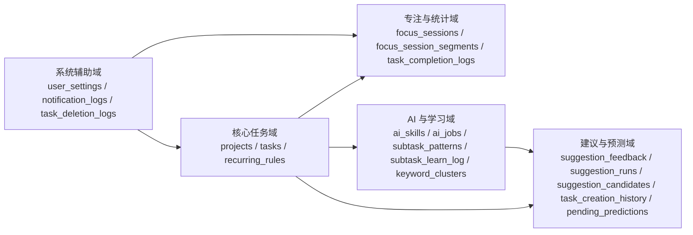
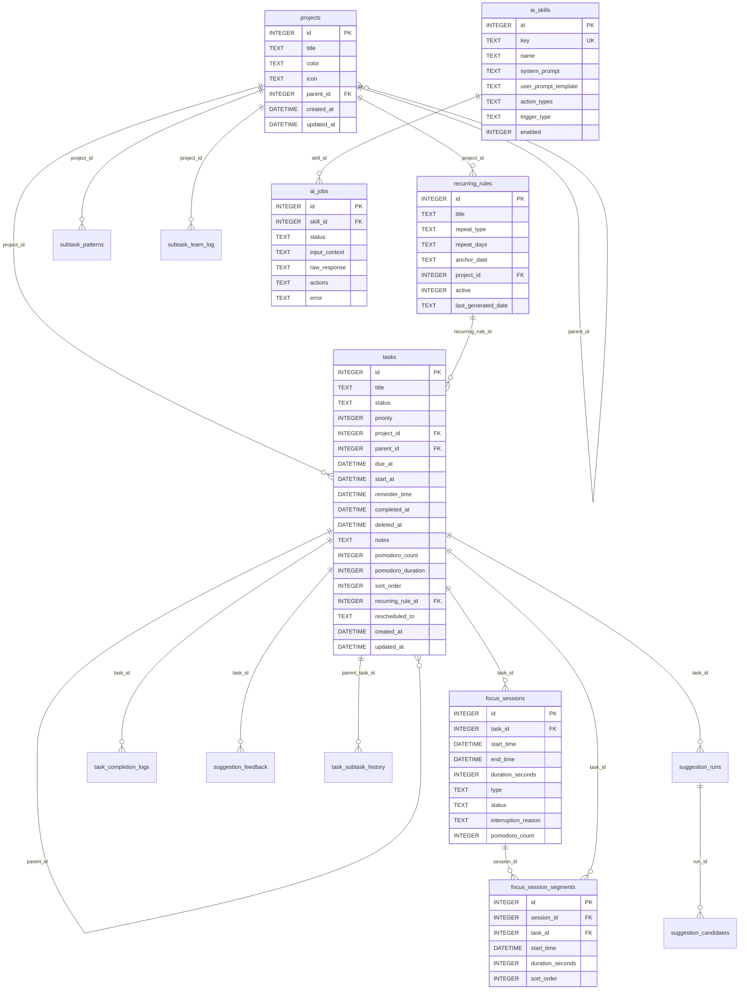
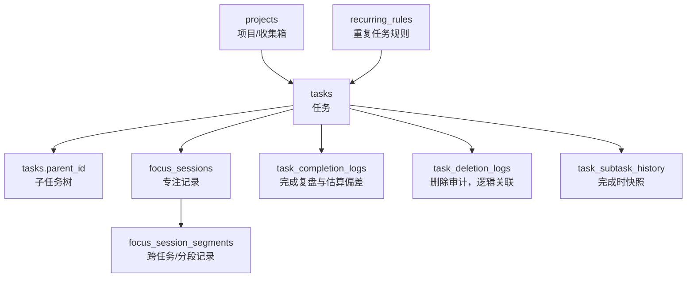
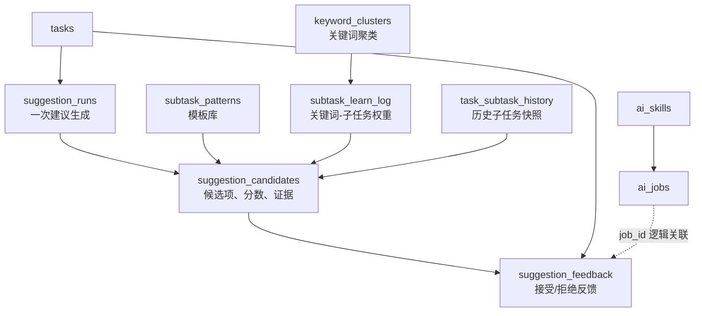
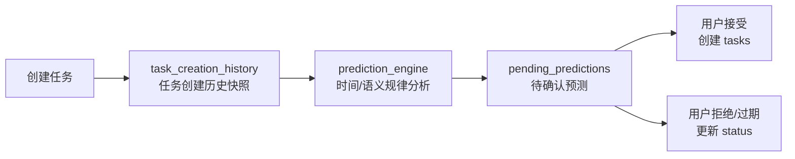
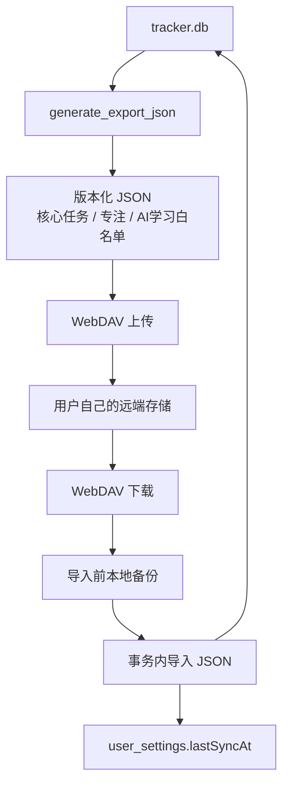
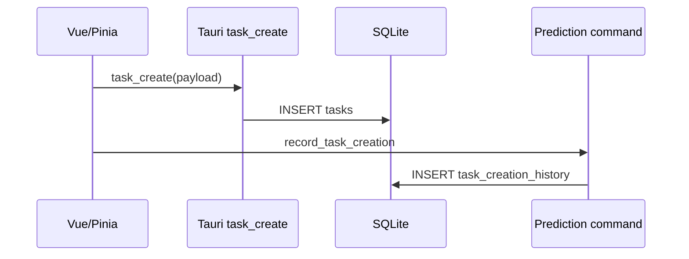
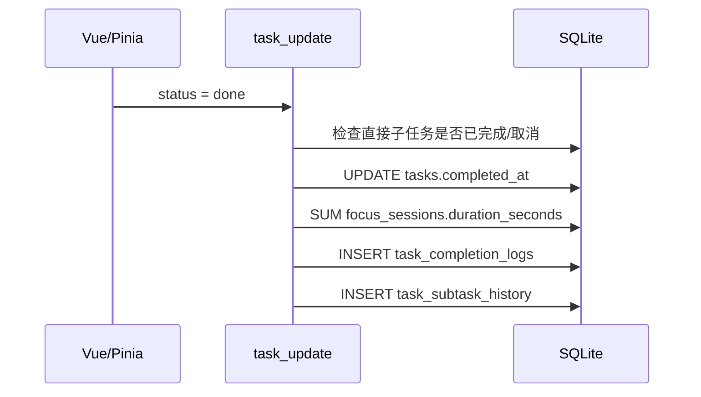
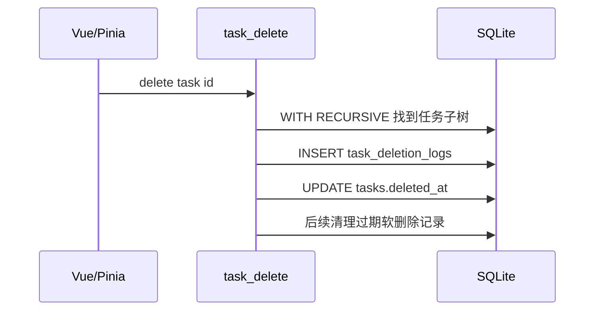
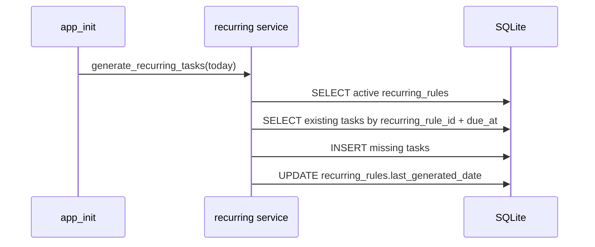

# Smart Focus Tracker 数据库设计说明

本文档说明当前 SQLite 数据库的表设计、实体关系和运行效果。当前实现以
`src-tauri/src/db/mod.rs` 为准，`PRAGMA user_version = 2`。
v1 被视为**全新设计的第一版**：全新数据库由单一基线 schema 在一个事务内一次建成，
不兼容任何更早构建产生的数据库文件（启动时直接报错拒绝）。
今后变更 schema 的方式：把变更合并进基线 + 写一个"上一版本→新版本"的单步迁移 + 版本号 +1。
当前迁移阶梯只有一步：v1 → v2 为 `pending_predictions` 增加 `actioned_at` 列
（记录用户接受/拒绝预测的精确时间，供预测反馈按动作时间衰减）。

## 1. 总体设计

数据库文件名为 `tracker.db`，由 Rust 后端统一打开和读写，前端通过 Tauri commands 访问数据。
初始化时启用 WAL 与外键：

- `PRAGMA journal_mode=WAL`
- `PRAGMA foreign_keys=ON`

整体可以分为 5 组表：

## 2. 核心 ER 图

下图只展示数据库真实外键关系。

## 3. 业务关系图

### 3.1 任务主链路

### 3.2 AI 子任务建议链路

说明：

- `suggestion_runs` 与 `suggestion_candidates` 是建议生成过程的审计表，记录分析结果、候选来源、分数和证据。
- `suggestion_feedback` 记录用户对某条建议的动作，用于后续学习；`job_id` 没有外键约束，是逻辑关联。
- `subtask_learn_log.cluster_id` 没有外键约束，当前聚类关系主要通过关键词 JSON 与查询逻辑维护。

### 3.3 预测任务链路

说明：

- `task_creation_history` 是预测用快照，不外键引用 `tasks`，这样任务删除后仍可保留行为样本。
- `pending_predictions.project_id` 是逻辑关联字段，没有外键约束，避免项目清理影响预测历史。

### 3.4 同步和导入导出关系

当前同步导出的 JSON 覆盖：`tasks`、`projects`、`focusSessions`、`settings`、`recurringRules`、
`taskCompletionLogs`、`focusSessionSegments`、`aiSkills`、`aiJobs`、`subtaskPatterns`、
`subtaskLearnLog`、`keywordClusters`、`suggestionFeedback`、`taskSubtaskHistory`。

导入时会先清空相关业务表，再按依赖顺序导入上述白名单数据。需要注意：`notification_logs`、
`task_deletion_logs`、`suggestion_runs`、`suggestion_candidates`、`task_creation_history`、
`pending_predictions` 当前不在 JSON 同步白名单内；
其中部分表会在导入前被清空，属于“本地运行态/历史审计”数据，而不是完整跨设备同步数据。

## 4. 表分组说明

### 4.1 核心任务表

| 表 | 作用 | 关键设计 |
| --- | --- | --- |
| `projects` | 项目和默认收集箱 | `parent_id` 自引用支持项目层级；删除项目时命令层先把任务转移到收集箱 |
| `tasks` | 任务、子任务、归档和软删除 | `parent_id` 自引用；`status` 表示 todo/done/cancelled（「进行中」是计时器的运行时状态，由前端 timerStore 派生展示，不落库）；`deleted_at` 支持软删除；`completed_at` 支持归档游标 |
| `recurring_rules` | 重复任务模板 | 保存重复类型、锚点日期、自定义星期、上次生成日期；生成出的任务回写 `tasks.recurring_rule_id` |

任务层级约束主要在命令层完成：最大嵌套深度 10、单任务最多 50 个直接子任务，并防止循环父子关系。

### 4.2 专注与统计表

| 表 | 作用 | 关键设计 |
| --- | --- | --- |
| `focus_sessions` | 一次专注/休息会话 | 可关联任务；任务删除时 `task_id` 置空，保留历史时间记录 |
| `focus_session_segments` | 会话分段 | 一个会话可拆分为多个分段；用于跨任务计时或恢复计时轨迹 |
| `task_completion_logs` | 完成复盘 | 任务完成时写入估算秒数、实际秒数和偏差百分比；任务硬删除时级联删除 |
| `task_deletion_logs` | 删除审计 | 不设置外键，保留被删任务标题和删除时间 |

### 4.3 AI 与学习表

| 表 | 作用 | 关键设计 |
| --- | --- | --- |
| `ai_skills` | AI 技能配置 | `key` 唯一；内置技能与用户技能共用结构；prompt 和 action 类型以文本/JSON 存储 |
| `ai_jobs` | AI 任务队列 | 关联 `ai_skills`；保存输入上下文、原始响应、动作 JSON、错误和完成时间 |
| `subtask_patterns` | 子任务模板库 | `keywords` 和 `subtasks` 为 JSON 文本；可按项目限定 |
| `subtask_learn_log` | 关键词学习权重 | 记录 keyword、subtask_title、score、source，用于个性化推荐 |
| `keyword_clusters` | 关键词聚类 | `keywords` 为 JSON 文本，用于扩展相似关键词 |

### 4.4 建议、反馈与预测表

| 表 | 作用 | 关键设计 |
| --- | --- | --- |
| `suggestion_feedback` | 建议反馈 | 记录建议来源、动作、任务标题快照；`job_id` 为逻辑关联 |
| `task_subtask_history` | 历史子任务快照 | 父任务完成时保存直接子任务标题 JSON，用于复用历史模板 |
| `suggestion_runs` | 建议生成批次 | 保存输入任务、分析 JSON、策略、排序器版本 |
| `suggestion_candidates` | 建议候选明细 | 保存候选标题、合并来源、分数、证据、展示排名、是否选中/拒绝 |
| `task_creation_history` | 创建任务历史 | 保存创建时间衍生字段 `dow/hour/day_of_month`，用于预测规律 |
| `pending_predictions` | 待确认预测 | 保存预测标题、原因、日期、状态、算法版本（当前 `local-v2`）、0-100 校准分数、分数明细 JSON 和去重 key；`notified_at`/`actioned_at` 分别记录通知与用户动作时间；刷新时与上一批次 reconcile（保留仍然成立的行，避免重复通知与误判负反馈） |

### 4.5 系统辅助表

| 表 | 作用 | 关键设计 |
| --- | --- | --- |
| `user_settings` | 键值设置 | `key` 唯一；用于计时器状态、同步时间等轻量配置 |
| `notification_logs` | 通知中心历史 | 支持已读状态、payload JSON 和按时间/类型查询 |

## 5. 真实外键与逻辑关联

| 来源字段 | 目标表 | 关系类型 | 删除行为 |
| --- | --- | --- | --- |
| `projects.parent_id` | `projects.id` | 真实外键 | `ON DELETE SET NULL` |
| `tasks.project_id` | `projects.id` | 真实外键 | `ON DELETE SET NULL`，但项目删除命令会先迁移到收集箱 |
| `tasks.parent_id` | `tasks.id` | 真实外键 | `ON DELETE CASCADE` |
| `tasks.recurring_rule_id` | `recurring_rules.id` | 真实外键 | `ON DELETE SET NULL` |
| `recurring_rules.project_id` | `projects.id` | 真实外键 | `ON DELETE SET NULL` |
| `focus_sessions.task_id` | `tasks.id` | 真实外键 | `ON DELETE SET NULL` |
| `focus_session_segments.session_id` | `focus_sessions.id` | 真实外键 | `ON DELETE CASCADE` |
| `focus_session_segments.task_id` | `tasks.id` | 真实外键 | `ON DELETE SET NULL` |
| `task_completion_logs.task_id` | `tasks.id` | 真实外键 | `ON DELETE CASCADE` |
| `ai_jobs.skill_id` | `ai_skills.id` | 真实外键 | 默认限制/无动作 |
| `subtask_patterns.project_id` | `projects.id` | 真实外键 | `ON DELETE SET NULL` |
| `subtask_learn_log.project_id` | `projects.id` | 真实外键 | `ON DELETE SET NULL` |
| `suggestion_feedback.task_id` | `tasks.id` | 真实外键 | `ON DELETE CASCADE` |
| `task_subtask_history.parent_task_id` | `tasks.id` | 真实外键 | `ON DELETE CASCADE` |
| `suggestion_runs.task_id` | `tasks.id` | 真实外键 | `ON DELETE CASCADE` |
| `suggestion_candidates.run_id` | `suggestion_runs.id` | 真实外键 | `ON DELETE CASCADE` |
| `suggestion_feedback.project_id` | `projects.id` | 逻辑关联 | 无数据库约束 |
| `suggestion_feedback.job_id` | `ai_jobs.id` | 逻辑关联 | 无数据库约束 |
| `task_subtask_history.project_id` | `projects.id` | 逻辑关联 | 无数据库约束 |
| `task_creation_history.project_id` | `projects.id` | 逻辑关联 | 无数据库约束 |
| `pending_predictions.project_id` | `projects.id` | 逻辑关联 | 无数据库约束 |
| `subtask_learn_log.cluster_id` | `keyword_clusters.id` | 逻辑关联/预留 | 无数据库约束 |

## 6. 索引设计

当前索引主要服务热路径查询：

| 索引 | 表 | 用途 |
| --- | --- | --- |
| `idx_tasks_deleted_at` | `tasks` | 软删除清理 |
| `idx_tasks_parent_id` | `tasks` | 子任务树展开 |
| `idx_tasks_project_deleted` | `tasks` | 按项目过滤未删除任务 |
| `idx_tasks_archive_ts` | `tasks` | 已完成/已取消归档分页，按 `completed_at DESC, id DESC` |
| `idx_tasks_status_completed` | `tasks` | 工作集、状态和完成时间过滤 |
| `idx_focus_sessions_start_time` | `focus_sessions` | 时间范围统计 |
| `idx_focus_sessions_task_id` | `focus_sessions` | 按任务汇总实际专注时长 |
| `idx_notification_logs_*` | `notification_logs` | 通知列表、未读筛选 |
| `idx_ai_jobs_status` / `idx_ai_jobs_skill_id` | `ai_jobs` | AI 队列状态与技能过滤 |
| `idx_subtask_learn_keyword` | `subtask_learn_log` | 关键词推荐 |
| `idx_subtask_learn_project` | `subtask_learn_log` | 项目内学习推荐 |
| `idx_suggestion_feedback_project` | `suggestion_feedback` | 项目维度反馈统计 |
| `idx_suggestion_feedback_source` | `suggestion_feedback` | 来源和动作过滤 |
| `idx_task_subtask_history_title` | `task_subtask_history` | 标题相似历史检索 |
| `idx_task_creation_history_created_at` | `task_creation_history` | 按时间窗口分析创建历史 |
| `idx_task_creation_history_dow_hour` | `task_creation_history` | 星期和小时模式分析 |
| `idx_pending_predictions_status` | `pending_predictions` | 待处理预测筛选 |
| `idx_pending_predictions_predicted_for_date` | `pending_predictions` | 按预测日期筛选 |
| `idx_pending_predictions_algorithm_version` | `pending_predictions` | 算法版本批次判断 |
| `idx_pending_predictions_title_key` | `pending_predictions` | 标题去重和状态过滤 |
| `idx_suggestion_runs_task_id` / `idx_suggestion_runs_created_at` | `suggestion_runs` | 按任务和时间追踪建议 |
| `idx_suggestion_candidates_run_id` | `suggestion_candidates` | 读取一次建议的候选列表 |

其中 `idx_tasks_archive_ts` 和 `idx_tasks_status_completed` 是带 `WHERE deleted_at IS NULL` 的部分索引，适合当前几乎所有任务查询都排除软删除记录的模式。

## 7. 关键数据生命周期

### 7.1 创建任务

### 7.2 完成任务

### 7.3 删除任务

### 7.4 重复任务生成

## 8. 设计效果评估

### 8.1 已经体现出的优点

1. 核心模型清晰：`projects -> tasks -> focus_sessions` 支撑项目、任务、子任务、专注记录和统计，是应用最稳定的主链路。
2. 任务层级设计实用：`tasks.parent_id` 让任务和子任务共用一张表，配合递归查询和命令层校验，可以支持较深层级同时避免循环。
3. 历史数据保护较好：专注记录在任务删除时保留，`task_deletion_logs` 和快照表保存标题，适合做统计和回溯。
4. 性能意识明确：归档、软删除、子任务展开、专注统计、预测去重都有针对性索引，部分索引减少了已删除任务对热查询的干扰。
5. AI 功能扩展性较强：技能、任务队列、模板、学习日志、反馈、建议追踪分层存储，既能执行 AI，又能解释候选来源和学习反馈。
6. 离线优先：SQLite 本地持久化，导入导出和 WebDAV 同步以 JSON 为边界，适合桌面应用和个人数据所有权场景。

### 8.2 当前不足和风险

1. ~~迁移实现按版本顺序执行，但没有把每个版本统一包进显式事务。~~ 已解决：v1 基线建库包在显式事务中，失败即整体回滚并阻止应用启动。
2. 一些重要字段是逻辑关联而非外键，例如 `pending_predictions.project_id`、`suggestion_feedback.job_id`、`subtask_learn_log.cluster_id`。这提升了历史数据保留能力，但也允许孤儿引用存在。
3. 多个表用 JSON 文本保存结构化数据，例如 `keywords`、`subtasks`、`analysis_json`、`evidence_json`。这降低了迁移成本，但复杂统计和精确查询会比较困难。
4. ~~`tags`、`task_tags`、`daily_summaries`、`ai_logs` 已建表但当前业务使用较少。~~ 已解决：四张预留/遗留表在 v1 基线中删除，schema 只保留有业务读写的表。
5. 部分约束在命令层而非数据库层，例如任务状态枚举、优先级范围、重复规则类型、标题长度。只通过 commands 访问时问题不大，但导入或调试直写数据库时需要额外小心。
6. `docs/tracker_schema.sql` 已落后于当前迁移版本，容易误导维护者，建议重新导出或标注为历史文件。

### 8.3 结论

当前数据库设计对一个本地优先的专注任务桌面应用是有效的：主业务表规范化程度足够，任务和专注统计的查询路径有索引支撑，AI 学习表使用追加日志和快照避免破坏核心业务数据。剩余技术债集中在逻辑关联一致性和 JSON 字段可查询性上。

短期维护建议：

1. ~~为后续迁移增加显式事务，并在迁移失败时停止应用启动。~~ 已在 v1 基线重构中完成。
2. ~~重新生成当前版本的 schema 导出，替换或归档旧 `tracker_schema.sql`。~~ 已删除过时导出；权威 schema 见 `src-tauri/src/db/mod.rs` 的 `BASELINE_SCHEMA`。
3. ~~标注或删除长期不用的 `ai_logs`、`daily_summaries`、标签相关表。~~ 已在 v1 基线中删除。
4. 对高价值逻辑关联增加命令层一致性检查或补充外键，例如 `suggestion_feedback.project_id`。
5. 如果 AI 建议分析需要复杂统计，可以逐步把部分 JSON 字段拆成子表，而不是一次性重构全部 AI 表。
